# Istio 数据面架构

如果要了解一个系统的核心机理，那么首先应该看看系统的主要数据流。Istio 也不例外。下面我们看看 Istio数据面的部署架构。

```{note}
本节的实验环境说明见于： {ref}`appendix-lab-env/appendix-lab-env-base:简单分层实验环境`
```

:::{figure-md} 图：Istio数据面架构



*图：Istio 数据面架构*
:::
*[用 Draw.io 打开](https://app.diagrams.net/?ui=sketch#Uhttps%3A%2F%2Fistio-insider.mygraphql.com%2Fzh_CN%2Flatest%2F_images%2Fistio-data-panel-arch.drawio.svg)*

{ref}`图：Istio数据面架构` 就是调用链: `client ➔ fortio-server:8080 ➔ fortio-server-l2:8080` 的数据面关系图。图中的数字是端口号。 


## netfilter/iptables

{ref}`图：Istio数据面架构`  中的 `kernel netfilter`  是一些 TCP 连接的拦截与转发规则，可以这样查看：

```bash
export WORKNODE=xzy #关注的 POD 运行的 worknode
ssh $WORKNODE
export POD=fortio-server #关注的 POD 名字
ENVOY_PIDS=$(pgrep envoy)
while IFS= read -r ENVOY_PID; do
    if [ $(sudo nsenter -u -t $ENVOY_PID hostname)=="$POD" ]; then
        export TARGET_ENVOY_PID=$ENVOY_PID
    fi
done <<< "$ENVOY_PIDS"

sudo nsenter -n -t $TARGET_ENVOY_PID iptables-save
```

输出：

```
*nat
:PREROUTING ACCEPT [1112:66720]
:INPUT ACCEPT [1112:66720]
:OUTPUT ACCEPT [152:13538]
:POSTROUTING ACCEPT [152:13538]
:ISTIO_INBOUND - [0:0]
:ISTIO_IN_REDIRECT - [0:0]
:ISTIO_OUTPUT - [0:0]
:ISTIO_REDIRECT - [0:0]
-A PREROUTING -p tcp -j ISTIO_INBOUND
-A OUTPUT -p tcp -j ISTIO_OUTPUT
-A ISTIO_INBOUND -p tcp -m tcp --dport 15008 -j RETURN
-A ISTIO_INBOUND -p tcp -m tcp --dport 22 -j RETURN
-A ISTIO_INBOUND -p tcp -m tcp --dport 15090 -j RETURN
-A ISTIO_INBOUND -p tcp -m tcp --dport 15021 -j RETURN
-A ISTIO_INBOUND -p tcp -m tcp --dport 15020 -j RETURN
-A ISTIO_INBOUND -p tcp -j ISTIO_IN_REDIRECT
-A ISTIO_IN_REDIRECT -p tcp -j REDIRECT --to-ports 15006
-A ISTIO_OUTPUT -s 127.0.0.6/32 -o lo -j RETURN
-A ISTIO_OUTPUT ! -d 127.0.0.1/32 -o lo -m owner --uid-owner 1337 -j ISTIO_IN_REDIRECT
-A ISTIO_OUTPUT -o lo -m owner ! --uid-owner 1337 -j RETURN
-A ISTIO_OUTPUT -m owner --uid-owner 1337 -j RETURN
-A ISTIO_OUTPUT ! -d 127.0.0.1/32 -o lo -m owner --gid-owner 1337 -j ISTIO_IN_REDIRECT
-A ISTIO_OUTPUT -o lo -m owner ! --gid-owner 1337 -j RETURN
-A ISTIO_OUTPUT -m owner --gid-owner 1337 -j RETURN
-A ISTIO_OUTPUT -d 127.0.0.1/32 -j RETURN
-A ISTIO_OUTPUT -j ISTIO_REDIRECT
-A ISTIO_REDIRECT -p tcp -j REDIRECT --to-ports 15001
COMMIT

```