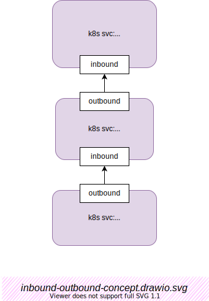

# Service Mesh 的一些基础概念

说好了，这书名叫《xyz内幕》，为何还要说基础概念？ 好吧，为了：
- 内容体系完整性
- 统一后面用到的术语

## 服务调用关系概念

### upstream/downstream

从 Envoy 的角度看：

- `upstream`:   流量方向中的角色：[downstream] --> envoy --> **[upstream]**。这里我避免用中文词 `上游/下游`，因为概念上没有统一，也容易和英文误解。
- `downstream`:  流量方向中的角色：**[downstream]** --> envoy --> [upstream]

```{warning}
 需要注意的是，upstream 与 downstream 是个相对于观察者的概念。

 如场景: `service A` ⤚调用➔ `service B`  ⤚调用➔ `service C` :

 - 如果站在 `service C` 上，我们在把` service B` 叫 downstream;

 - 如果站在 `service A` 上，我们把 `service B` 叫 upstream。
```

### Inbound/Outbound

从 K8s 的 pod 的角度看：

:::{figure-md} Inbound与Outbound概念



*图：Inbound与Outbound概念*
[用 Draw.io 打开](https://app.diagrams.net/#Uhttps%3A%2F%2Fistio-insider.mygraphql.com%2Fzh_CN%2Flatest%2F_images%2Finbound-outbound-concept.drawio.svg)
:::


有3个服务，自下而上地调用。

1. client
2. fortio-server:8080
3. fortio-server-l2:8080

其实调用关系就是:

> client ➔ fortio-server:8080 ➔ fortio-server-l2:8080

上图这样排版也是想直接反映 **up**stream 和 **down**stream 字面义。图中需要解释的，或者只有 inbound / outbound 这两个术语。首先，什么是 `bound`。

- `bound`: 字面意为边界。有人译为`站（名词）`。而在现实的 k8s + istio 环境中，可以理解为 pod / service
- `inbound`: 有人译为`入站`。而在现实的 k8s + istio 环境中，可以理解为流量从 pod 外部进入 pod。即服务的被调用流量
- `outbound`: 有人译为`出站`。而在现实的 k8s + istio 环境中，可以理解为流量从 pod 内部输出到 pod 外部。

> 需要注意的是，对于同一个调用请求。他可以是调用者 service 的 outbound，同时也是被调用者的 inbound。如上图

