# 事件驱动与线程模型


不出意外，Envoy 使用了 libevent 这个 C 事件 library， libevent 使用了 Linux Kernel 的 epoll 事件驱动 API。

说明一下图中的流程：
1. Envoy worker 线程挂起在 `epoll_wait()` 方法中，在内核中注册等待 epoll 关注的 socket 发生事件。线程被移出 kernel 的 runnable queue。线程睡眠。
2. 内核收到 TCP 网络包，触发事件
3. 操作系统把 Envoy worker 线程被移入 kernel 的 runnable queue。Envoy worker 线程被唤醒，变成 runnable。操作系统发现可用 cpu 资源，把 runnable 的 envoy worker 线程调度上 cpu。（注意，runnable 和 调度上 cpu 不是一次完成的）
4. Envoy 分析事件列表，按事件列表的 fd 调度到不同的 `FileEventImpl` 类的回调函数（实现见：`FileEventImpl::assignEvents`）
5. `FileEventImpl` 类的回调函数调用实际的业务回调函数
6. 执行 Envoy 的实际代理行为
7. 完事后，回到步骤 1 。


## HTTP 反向代理的总流程

整体看，Socket 事件驱动的 HTTP 反向代理总流程如下：


图中看出，有4种事件驱动了整个流程。后面几节会逐个分析。

## Downstream TCP 连接建立

现在看看，事件驱动和连接的建立的过程和关系：



1. Envoy worker 线程挂起在 `epoll_wait()` 方法中。线程被移出 kernel 的 runnable queue。线程睡眠。
2. client 建立连接，server 内核完成3次握手，触发 listen socket 事件。
   - 操作系统把 Envoy worker 线程被移入 kernel 的 runnable queue。Envoy worker 线程被唤醒，变成 runnable。操作系统发现可用 cpu 资源，把 runnable 的 envoy worker 线程调度上 cpu。（注意，runnable 和 调度上 cpu 不是一次完成的）
3. Envoy 分析事件列表，按事件列表的 fd 调度到不同的 FileEventImpl 类的回调函数（实现见：`FileEventImpl::assignEvents`）
4. FileEventImpl 类的回调函数调用实际的业务回调函数，进行 syscall `accept`，完成 socket 连接。得到新 socket 的 FD: `$new_socket_fd`。
5. 业务回调函数把 调用 `epoll_ctl` 把 `$new_socket_fd ` 加到 epoll 监听中。
6. 回到步骤 1 。


## 事件处理抽象框架

上面主要在 kernel syscall 层面上介绍事件处理的底层过程。下面介绍在 Envoy 代码层面，如何抽象和封装事件。

Envoy 使用了 libevent 这个 C 编写的事件 library。还在其上作了 C++ OOP 方面的封装。


如何快速在一个重度（甚至过度）使用 OOP 封装和 OOP Design Pattern 的项目中读懂核心流程逻辑，而不是在源码海洋中无方向地漂流? 答案是：找到主线。 对于 Envoy 的事件处理，主线当然是 `libevent` 的 `event_base` ，`event` 。如果你对 libevent 还不了解，可以看看本书的 `libevent 核心思想` 一节。

- `event` 封装到 `ImplBase` 对象中。 
- `event_base` 包含在 `LibeventScheduler` <- `DispatcherImpl` <- `WorkerImpl` <- `ThreadImplPosix` 下

然后，不同类型的 `event` ，又封装到不同的  `ImplBase` 子类中：
- TimerImpl
- SchedulableCallbackImpl
- FileEventImpl

其它信息上图已经比较详细，不再多言了。

## libevent 核心思想

```{toctree}
libevent.md
```


## 扩展阅读

如果有兴趣研究实现细节，建议看看我 Blog 的文章：

 - [逆向工程与云原生现场分析 Part3 —— eBPF 跟踪 Istio/Envoy 事件驱动模型、连接建立、TLS 握手与 filter_chain 选择](https://blog.mygraphql.com/zh/posts/low-tec/trace/trace-istio/trace-istio-part3/)
 - [逆向工程与云原生现场分析 Part4 —— eBPF 跟踪 Istio/Envoy 之 upstream/downstream 事件驱动协作下的 HTTP 反向代理流程](https://blog.mygraphql.com/zh/posts/low-tec/trace/trace-istio/trace-istio-part4/)

与 Envoy 作者 Matt Klein 的： [Envoy threading model](https://blog.envoyproxy.io/envoy-threading-model-a8d44b922310)