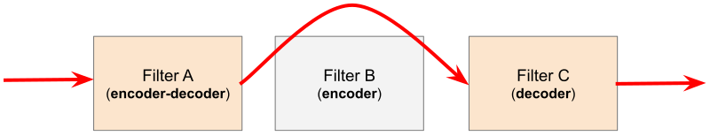
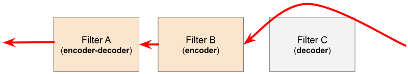

# http connection manager

首先，http connection manager(HCM) 在 Listener 的角度看，是一个 Network Filter。

为了扩展性，Envoy 的 http connection manager 采用了经典的 filter chain 设计模式。这个和 Listener Filter Chain 有一点类似：

:::{figure-md} 图：http connection manager 设计模型
:class: full-width 


*图：http connection manager 设计模型*
:::
*[用 Draw.io 打开](https://app.diagrams.net/?ui=sketch#Uhttps%3A%2F%2Fistio-insider.mygraphql.com%2Fzh_CN%2Flatest%2F_images%2Fhttp-connection-manager.drawio.svg)*


请求 filter 流如下：


*图源：[life_of_a_request](https://www.envoyproxy.io/docs/envoy/latest/intro/life_of_a_request#http-filter-chain-processing)*

响应 filter 流如下：


*图源：[life_of_a_request](https://www.envoyproxy.io/docs/envoy/latest/intro/life_of_a_request#http-filter-chain-processing)*


## http filter 抽象对象定义

HttpFilter 在源码中叫 `StreamFilter` 或更精确叫 `Http::StreamFilterBase` 。一个 `http connection manager` 拥有一个 `Http::FilterManager`， `FilterManager` 拥有 `list<StreamFilterBase*> filters_` 。

:::{figure-md} 图：http filter 抽象对象
:class: full-width


*图：http filter 抽象对象*
:::
*[用 Draw.io 打开](https://app.diagrams.net/?ui=sketch#Uhttps%3A%2F%2Fistio-insider.mygraphql.com%2Fzh_CN%2Flatest%2F_images%2Fhttp-filter-abstract.drawio.svg)*


## http filter C++类关系

:::{figure-md} 图：http filter C++类关系
:class: full-width


*图：http filter C++类关系*
:::
*[用 Draw.io 打开](https://app.diagrams.net/?ui=sketch#Uhttps%3A%2F%2Fistio-insider.mygraphql.com%2Fzh_CN%2Flatest%2F_images%2Fhttp-filter-code-oop.drawio.svg)*


```{toctree}
hcm-event-process.md
```