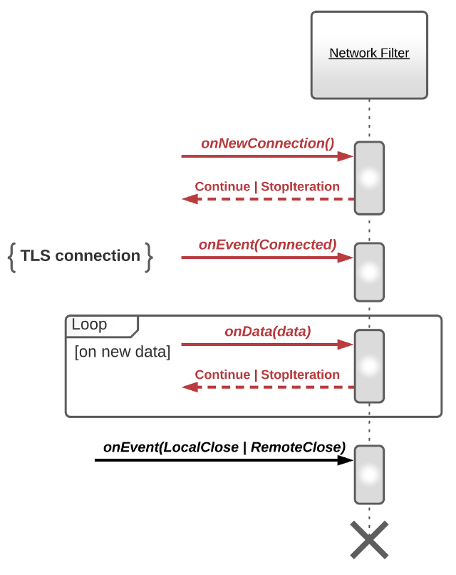

# Taming a Network Filter

> Source: [https://blog.envoyproxy.io/taming-a-network-filter-44adcf91517](https://blog.envoyproxy.io/taming-a-network-filter-44adcf91517)

If you are considering developing a custom Envoy extension, it is crucial to have a solid understanding of how request processing works in Envoy and the role Envoy extensions play.

Today, we will take a closer look at Network Filters.

We begin with Network Filters partly because they have a simpler model, but also because support for HTTP in Envoy is implemented as yet another Network Filter. It wouldn’t be possible to explain HTTP Filters without referring to Network Filters first.

We’ll start from a general overview and then go over the practical applications.

Let’s get going!

# Lifecycle of a Network Filter

Envoy is fundamentally a L3/L4 proxy capable of handling any protocols at or above that level.

The workhorse of Envoy is a Listener — a concept responsible for accepting incoming (also known as “downstream”) connections and kicking off the request processing flow.

Each connection is processed by passing received data through a series of Network Filters collectively referred to as a Filter Chain.

Network Filters intercept data (TCP payloads) flowing in both directions:

*Figure 1*

The “`Downstream > Envoy > Upstream`” path is referred to in Envoy as the “`read`” path, and the opposite direction is referred to as the “`write`” path.

Unlike the Filter concept you’ve seen in other APIs, **Filters in Envoy are stateful. A separate instance of Network Filter is allocated for every connection**.

The interface of a Network Filter consists of the following callbacks.

On the “read” path:

*Figure 2*

On the “write” path:

*Figure 3*

A Network Filter may also subscribe to connection events:

*Figure 4*

As mentioned earlier, Envoy processes received data by iterating through the filter chain.

On connect from the Downstream, Envoy will iterate through the filter chain to call `onNewConnection()`.

*Figure 5*

If a Network Filter returns `StopIteration` from its callback, Envoy will not proceed to the next filter in the chain.

Beware that StopIteration only means <mark>“don’t call filters after me for this particular iteration cycle”</mark> as opposed to “don’t do any further processing on that connection until I give a green light”.

For example, even if a Network Filter returns `StopIteration` from its `onNewConnection()` callback, once Envoy receives a chunk of request data from the Downstream, it will iterate through the filter chain again, this time calling the `onData()` callback. <mark>Filters that haven’t seen `onNewConnection()` yet are guaranteed to see it prior to `onData()`</mark>.

From a perspective of a single Network Filter, request processing flow looks the following way.

On the “read” path:

*Figure 6*

On the “write” path:

*Figure 7*

We will explain the difference between `onNewConnection()` and `onEvent(Connected)` in the section on Gatekeeping along with a practical example.

Right now, let’s focus on `StopIteration` and the effect it has on data buffering in Envoy.

The first thing to know is that “read” and “write” paths in Envoy are not symmetrical and will be described separately.

On the “read” path:

When Envoy receives a new chunk of request data from the Downstream:

- First, it appends the new chunk into the “read” buffer.
- Next, it iterates over the filter chain calling `onData()` with the entire “read” buffer as a parameter (as opposed to the new chunk only).
- The “read” buffer will normally be drained by the terminal filter in the chain (e.g., TcpProxy).
- However, **if one of the filters in the chain returns `StopIteration` without draining the buffer, the data will remain buffered.**

When Envoy receives the next chunk of request data from the Downstream:

- It will again append to the “read” buffer.
- Next, it iterates over the filter chain calling `onData()` with the entire “read” buffer as parameter.

The important thing to notice is that, **due to the presence of the “read” buffer, a Network Filter might observe the same data twice in its `onData()` callback**!

Finally, how safe is it to let the “read” buffer keep growing? Can it grow indefinitely or overflow? The good news is that **Envoy takes care of this aspect automatically and will stop reading data from the socket as soon as the size of the “read” buffer exceeds the limit (1MiB by default)**.

On the “write” path:

There is no equivalent of the “read“ buffer on the “write” path.

When Envoy receives a new chunk of response data from the Upstream:

- It iterates over the filter chain calling onWrite() with the new chunk as parameter.
- If all filters in the chain return Continue, the chunk will be appended to the “write” buffer (response data ready to be sent back to the Downstream).
- If one of the filters returns `StopIteration`, the chunk will be dropped.

It’s worth noting one more time that `StopIteration` has effect only on a single iteration cycle through the filter chain. It’s not a signal to “stop further processing until I give a green light“. The next time Envoy receives a chunk of data, it will start calling filters again no matter whether they returned Continue or `StopIteration` last time. Consequently, if a filter needs to wait for some external event to occur, it has to keep returning `StopIteration` from `onData()`/`onWrite()` callback until that very moment.

To prevent the “write” buffer from overflowing, Envoy implements a concept of flow control (also known as “backpressure”). Its purpose is to stop receiving data from the remote side (i.e., Upstream) if the local buffer is full (i.e., “write” buffer on the “downstream” connection). You can learn more about flow control [here](https://github.com/envoyproxy/envoy/blob/master/source/docs/flow_control.md).

At this point, we’ve touched most of the request processing flow. The final group of related APIs — continueReading(), injectReadDataToFilterChain(), and injectWriteDataToFilterChain() — will be explained in the section on Reshaping Traffic with a practical example.

# Practical Applications

Not every Network Filter has to be as complicated as the HTTP Connection Manager.

Much more often, a Network Filter implements a single very specific action, such as rate limiting or authorization, and relies on other filters in the chain to do routing, load balancing, connecting to the Upstream, etc.

Let’s take a look into such practical applications of Network Filters.

## Gatekeeping

One simple application of Network Filters is rejecting unwanted connections.

A few great examples would be RBAC filter, External Authorization filter, Client SSL Auth filter, Rate Limit filter, etc.

These filters remain neutral to the application-level protocol and make use of only a few Envoy APIs.

A typical request flow implemented by this filters looks like this:

*Figure 8*

Although it might seem intuitive to always initiate an auxiliary external request from the context of `onNewConnection() `callback, it is not possible in certain cases.

Envoy calls `onNewConnection()` [at least, on the first filter in the filter chain] as soon as a new connection has been accepted by the Listener. However, in the case of TLS connections, TLS handshake is not yet complete at this point. If a Network Filter depends on information from the TLS handshake, e.g., Client SSL Auth filter, it cannot do much in `onNewConnection()`.

In such a case, a Network Filter should defer the auxiliary external request until `onEvent(Connected)` is called on that filter. Connected, despite such a general name, is in fact a very specific event that gets fired right after the TLS handshake completes successfully.

*Figure 9*

Beware of the difference between returning Continue vs `StopIteration` from `onNewConnection()` callback, which becomes apparent in the case of gatekeeping filters.

If a filter chain includes the TcpProxy filter (always the last filter in the chain), a listener will not start reading data from that connection until onNewConnection() is called on TcpProxy. Which means that returning `StopIteration` by a gatekeeping Network Filter might leave the connection in a stalemate (cannot proceed because it is not allowed to read data). Unfortunately, returning Continue has its own side effects. When `onNewConnection()` is called on TcpProxy, it immediately kicks off connection to the Upstream and then starts proxying the response from it, all happening before the decision whether to allow connection or not has been made by the gatekeeper. This is a good example where Envoy API could be made cleaner and safer by default.

Lastly, you might be wondering what happens to the request/response data when a Network Filter returns StopIteration. On the “read” path, data stays in the “read” buffer and the filter will see it again in the next call to `onData()`. On the “write” path, data gets dropped.

## Collecting Protocol-specific Stats

Support for a new application-level protocol in Envoy typically starts from a single feature — the ability to parse protocol messages and derive some metrics out of them.

Mongo, MySQL, Postgres, Zookeeper, Kafka filters are all good examples.

These filters do not modify data they proxy and leave routing and load balancing up to the TcpProxy filter.

Just having insights into the actual traffic is already a big deal and brings a lot of value on its own.

Network Filters in this category typically operate as follows:

*Figure 10*

Notice that in the model described above, the Network Filter assumes that `onData()` callback is always called on a new, previously unseen chunk of data.

However, `onData()` API does not guarantee that (as described earlier).

For the filter to work correctly, subsequent filter(s) in the chain must drain the “read” buffer (e.g., TcpProxy filter always does that).

In practice, it means that users/operators of Envoy have to be mindful of the configuration they choose. Filters like Mongo, MySQL, Postgres will work correctly when they are immediately followed by TcpProxy. However, injecting an arbitrary filter in between the two might lead to unexpected results.

Here is an example of the correct combination of filters:

*Figure 11*

And here is an example of the incorrect one:

*Figure 12*

## Feeding Protocol-specific Metadata

As an extension to the previous use case, a Network Filter can expose not only metrics but also fine-grained metadata derived from protocol messages.

Such metadata can later be used to power access decisions (e.g., by RBAC filter), to enrich access logs, etc.

*Figure 13*

## Reshaping Traffic

When speaking about traffic shaping, think of a Fault Injection filter that throttles traffic.

From a technical perspective, throttling implies shifting the time when the next chunk of data is forwarded to the Upstream or Downstream.

Request flow implemented by these filters look the following way.

On the “read” path:

*Figure 14*

On the “write” path:

*Figure 15*

In the above example traffic gets reshaped through combined use of onTimer() and `injectReadDataToFilterChain()` / `injectWriteDataToFilterChain()` / `continueReading()`.

`onTimer()` is not the only reason for traffic to change its shape. For example, filters can also invoke these API methods from callbacks after processing the results of HTTP or gRPC Client API calls.

## Protocol-specific Routing and Load Balancing

Network Filters that fall into this category are the most advanced ones, e.g. HTTP Connection Manager, Redis, Thrift, Dubbo, etc.

Instead of relying on TcpProxy for protocol-agnostic routing and load balancing, a Network Filter can take over and do this job much more efficiently.

For example, the `HTTP Connection Manager filter` (which implements support for HTTP/1.1 and HTTP/2 in Envoy) takes advantage of HTTP/2 multiplexing and cuts the number of “upstream” connections to down to 1.

Since these filters are responsible for forwarding data to Upstream, they are also in charge of implementing flow control: if the “write” buffer on the “downstream” connection gets full, then stop receiving data from the Upstream. Similarly, if the “write” buffer on the “upstream” connection gets full, then stop receiving data from the Downstream.

We will touch more on routing, load balancing and flow control in future blog posts.

# Native Envoy extensions (C++) vs WebAssembly

The Network Filter model and its practical applications we’ve described so far are applicable to both native (C++) and WebAssembly-based Envoy extensions.

Eventually, you will be able to achieve identical behaviour in both cases.

However, at the time of writing (early September 2020), WebAssembly support in Envoy implements only a subset of APIs available to native (C++) extensions:

- ✅ onNewConnection()
- ✅ onData()
- ✅ onWrite()
- ✅ onEvent(RemoteClose | LocalClose)
- ❌ onEvent(Connected)
- ❌ continueReading()
- ❌ injectReadDataToFilterChain()
- ❌ injectWriteDataToFilterChain()
- ❌ connection.close()
- ❌ setTimer() / onTimer()
- ❌ setDynamicMetadata()

# Conclusion

Today you’ve learned enough to be able to develop a Network Filter of your own.

For example, you could add support for a new SQL / NoSQL / object database, a new key-value store, a new message broker, etc.

In the simplest form, all you need to do is to integrate an existing protocol parsing library into Envoy request lifecycle, expose some metrics and profit :).

Take it as a challenge!

Make it even more interesting and do it in Rust 😉.

That’s all for today. See you in the next blog post where we will do a deep dive into HTTP Filters!
