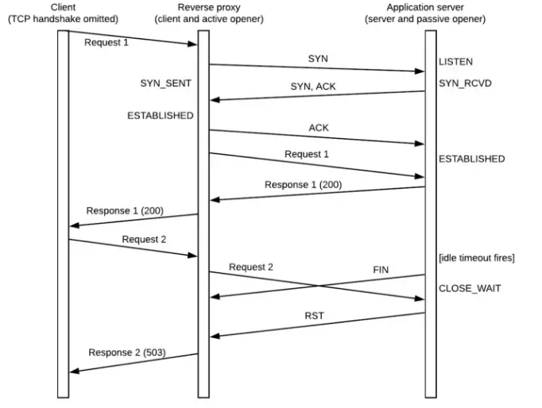

# Envoy 连接关闭后的竞态条件

由于下面使用到了 socket 一些比较底层和冷门的知识点。如 close socket 的一些临界状态和异常逻辑。如果不太了解，建议先阅读我写的：

[《Mark’s DevOps 雜碎》](https://devops-insider.mygraphql.com/zh_CN/latest/index.html) 中 [《Socket Close/Shutdown 的临界状态与异常逻辑》](https://devops-insider.mygraphql.com/zh_CN/latest/kernel/network/socket/socket-close/socket-close.html) 一文。

## Envoy 与 Downstream/Upstream 连接状态不同步

以下大部分情况，算是个发生可能性低的 race condition。但，在大流量下，再少的可能性也是有遇到的时候。`Design For Failure` 是程序员的天职。

### Downstream 向 Envoy 关闭中的连接发送请求

> [Github Issue: 502 on our ALB when traffic rate drops#13388](https://github.com/envoyproxy/envoy/issues/13388#issuecomment-703716766)
> Fundamentally, the problem is that ALB is reusing connections that Envoy is closing. This is an inherent(固有) race condition with HTTP/1.1. 
> You need to configure the `ALB max connection` / `idle timeout` to be < `any envoy timeout`.
> 
> To have no race conditions, the ALB needs to support `max_connection_duration` and have that be less than Envoy's max connection duration. There is no way to fix this with Envoy.


本质上是：

1. Envoy 调用 `close(fd)` 关闭了 socket。同时关闭了 fd。
   - 如果 `close(fd)` 时：
     - kernel 的 socket recv buffer 有数据未加载到 user-space ，那么 kernel 会发送 RST 给 downstream。原因是这数据是已经 TCP ACK 过的，而应用却丢弃了。
     - 否则，kernel 发送 FIN 给 downstream.
   - 由于关闭了 fd，这注定了如果 kernel 还在这个 TCP 连接上收到 TCP 数据包，就会丢弃且以 `RST` 回应。
2. Envoy 发出了 `FIN` 
3. Envoy socket kernel 状态更新为 `FIN_WAIT_1` 或 `FIN_WAIT_2`。

对于 Downstream 端，有两种可能：

- Downstream 所在 kernel 中的 socket 状态已经被 Envoy 发过来的 `FIN` 更新为 `CLOSE_WAIT` 状态，但 Downstream 程序(user-space)中未更新（即未感知到  `CLOSE_WAIT` 状态）。
- Downstream 所在 kernel 因网络延迟等问题，还未收到 `FIN`。

所以 Downstream 程序 re-use 了这个 socket ，并发送 HTTP Request(假设拆分为多个 IP 包) 。结果都是在某个 IP 包到达 Envoy kernel 时，Envoy kernel 返回了 RST。于是 Downstream kernel 在收到 RST 后，也关闭了socket。所以从某个 socket write 开始均会失败。失败说明是类似 `Upstream connection reset`. 这里需要注意的是， socket `write()` 是个异步的过程，不会等待对端的 ACK  就返回了。

- 一种可能是，某个 `write()` 时发现失败。这更多是 http keepalive 的 http client library 的行为。或者是 HTTP Body 远远大于 socket sent buffer 时，分多 IP 包的行为。
- 一种可能是，直到 `close()` 时，要等待 ACK 了，才发现失败。这更多是非 http keepalive 的 http client library 的行为。或者是 http keepalive 的 http client library 的最后一个请求时的行为。


从 HTTP 层面来看，有两种场景可能出现这个问题：

* 服务端过早关闭连接(Server Prematurely/Early Closes Connection)。

  Downsteam 在 write HTTP  Header 后，再 write HTTP Body。然而，Envoy 在未读完 HTTP Body 前，就已经 Write Response 且 `close(fd) `了 socket。这叫 `服务端过早关闭连接(Server Prematurely/Early Closes Connection)`。别以为 Envoy 不会出现未完全读完 Request 就 write Response and close socket 的情况。最少有几个可能性：

  - 只需要 Header 就可以判断一个请求是非法的。所以大部分是返回 4xx/5xx 的 status code。
  - HTTP Request Body 超过了 Envoy 的最大限制 `max_request_bytes`

  这时，有两个情况：

  - Downstream 的 socket 状态可能是 `CLOSE_WAIT`。还可以 `write()` 的状态。但这个 HTTP Body 如果被 Envoy 的 Kernel 收到，由于 socket 已经执行过 `close(fd) `， socket 的文件 fd 已经关闭，所以 Kernel 直接丢弃 HTTP Body 且返回 `RST` 给对端（因为 socket 的文件 fd 已经关闭，已经没进程可能读取到数据了）。这时，可怜的 Downstream 就会说：`Connection reset by peer` 之类的错误。

  - Envoy  调用 `close(fd)` 时，kernel 发现 kernel 的 socket buffer 未被 user-space 完全消费。这种情况下， kernel 会发送 `RST` 给 Downstream。最终，可怜的 Downstream 就会在尝试 `write(fd)` 或 `read(fd)` 时说：`Connection reset by peer` 之类的错误。

    > 见：[Github Issue: http: not proxying 413 correctly#2929](https://github.com/envoyproxy/envoy/issues/2929#top)
    >
    > ```
    > +----------------+      +-----------------+
    > |Listner A (8000)|+---->|Listener B (8080)|+----> (dummy backend)
    > +----------------+      +-----------------+
    > ```
    >
    > This issue is happening, because Envoy acting as a server (i.e. listener B in @lizan's example) **closes downstream connection with pending (unread) data, which results in TCP RST packet being sent downstream**.
    >
    > Depending on the timing, downstream (i.e. listener A in @lizan's example) might be able to receive and proxy complete HTTP response before receiving **TCP RST packet (which erases low-level TCP buffers)**, in which case client will receive response sent by upstream (413 Request Body Too Large in this case, but this issue is not limited to that response code), otherwise client will receive 503 Service Unavailable response generated by listener A (which actually isn't the most appropriate response code in this case, but that's a separate issue).
    >
    > The common solution for this problem is to half-close downstream connection using ::`shutdown(fd_, SHUT_WR)` and then read downstream until EOF (to confirm that the other side received complete HTTP response and closed connection) or `short timeout`.

  

  减少这种 race condition 的可行方法是：delay close socket。 Envoy 已经有相关的配置：[delayed_close_timeout](https://www.envoyproxy.io/docs/envoy/latest/api-v3/extensions/filters/network/http_connection_manager/v3/http_connection_manager.proto#:~:text=is%20not%20specified.-,delayed_close_timeout,-(Duration)%20The)

* Downstream 未感知到 HTTP Keepalive 的 Envoy 连接已经关闭，re-use 了连接。

  上面提到的 Keepalive 连接复用的时候。Envoy 已经调用内核的 `close(fd) `  把 socket 变为 `FIN_WAIT_1/FIN_WAIT_2` 的 状态，且已经发出 `FIN`。但 Downstream 未收到，或已经收到但应用未感知到，且同时 reuse 了这个 http keepalive 连接来发送 HTTP Request。在 TCP 协议层面看来，这是个 `half-close` 连接，未 close 的一端的确是可以发数据到对端的。但已经调用过 `close(fd)` 的 kernel (Envoy端) 在收到数据包时，直接丢弃且返回 `RST` 给对端（因为 socket 的文件 fd 已经关闭，已经没进程可能读取到数据了）。这时，可怜的 Downstream 就会说：`Connection reset by peer` 之类的错误。

  * 减少这种 race condition 的可行方法是：让 Upstream 对端配置比 Envoy 更小的 timeout 时间。让 Upsteam 主动关闭连接。

#### Envoy 实现上的缓解

##### 缓解 服务端过早关闭连接(Server Prematurely/Early Closes Connection)


> [Github Issue: http: not proxying 413 correctly #2929](https://github.com/envoyproxy/envoy/issues/2929)
>
> In the case envoy is proxying large HTTP request, even upstream returns 413, the client of proxy is getting 503.


> [Github PR: network: delayed conn close #4382](https://github.com/envoyproxy/envoy/pull/4382)，增加了 `delayed_close_timeout` 配置。
>
> Mitigate client read/close race issues on downstream HTTP connections by adding a new connection
> close type '`FlushWriteAndDelay`'. This new close type flushes the write buffer on a connection **but**
> **does not immediately close after emptying the buffer** (unlike `ConnectionCloseType::FlushWrite`).
>
> A timer has been added to track delayed closes for both '`FlushWrite`' and '`FlushWriteAndDelay`'. Upon
> triggering, the socket will be closed and the connection will be cleaned up.
>
> Delayed close processing can be disabled by setting the newly added HCM '`delayed_close_timeout`'
> config option to 0.
>
> Risk Level: Medium (changes common case behavior for closing of downstream HTTP connections)
> Testing: Unit tests and integration tests added.


但上面的 PR 在缓解了问题的同时也影响了性能：

> [Github Issue: HTTP/1.0 performance issues #19821](https://github.com/envoyproxy/envoy/issues/19821#issuecomment-1031536302)
>
> I was about to say it's probably delay-close related.
>
> So HTTP in general can frame the response with one of three ways: content length, chunked encoding, or frame-by-connection-close.
>
> If you don't haven an explicit content length, HTTP/1.1 will chunk, but HTTP/1.0 can only frame by `connection close`(FIN).
>
> Meanwhile, there's another problem which is that if a client is sending data, and the request has not been completely read, a proxy responds with an error and closes the connection, many clients will get a TCP RST (due to uploading after FIN(`close(fd)`)) and not actually read the response. That race is avoided with `delayed_close_timeout`.
>
> It sounds like Envoy could do better detecting if a request is complete, and if so, framing with immediate close and I can pick that up. In the meantime if there's any way to have your backend set a `content length` that should work around the problem, or you can lower delay close in the interim.

于是需要再 Fix:

> [Github PR: http: reduce delay-close issues for HTTP/1.1 and below #19863](https://github.com/envoyproxy/envoy/pull/19863)
>
> Skipping delay close for:
>
> - HTTP/1.0 framed by connection close (as it simply reduces time to end-framing) 
>
> - as well as HTTP/1.1 if the request is fully read (so there's no FIN-RST race)。即系如果
>
> Addresses the Envoy-specific parts of #19821
> Runtime guard: `envoy.reloadable_features.skip_delay_close`
>
> 同时出现在 [Envoy 1.22.0 的 Release Note](https://www.envoyproxy.io/docs/envoy/latest/version_history/v1.22/v1.22.0) 里。需要注意的是，为了不影响性能，delayed_close_timeout 在很多情况下是不会生效的：
>
> **http**: avoiding `delay-close` for:
>
> - HTTP/1.0 responses framed by `connection: close` 
> - as well as HTTP/1.1 if the request is fully read. 
>
> This means for responses to such requests, the FIN will be sent immediately after the response. This behavior can be temporarily reverted by setting `envoy.reloadable_features.skip_delay_close` to false. If clients are seen to be receiving sporadic partial responses and flipping this flag fixes it, please notify the project immediately.


### Envoy 向已被 Upstream 关闭的 Upstream 连接发送请求

> [Github Issue: Envoy (re)uses connection after receiving FIN from upstream #6815](https://github.com/envoyproxy/envoy/issues/6815)
> With Envoy serving as HTTP/1.1 proxy, sometimes Envoy tries to reuse a connection even after receiving FIN from upstream. In production I saw this issue even with couple of seconds from FIN to next request, and Envoy never returned FIN ACK (just FIN from upstream to envoy, then PUSH with new HTTP request from Envoy to upstream). Then Envoy returns 503 UC even though upstream is up and operational.


> [Istio: 503's with UC's and TCP Fun Times](https://karlstoney.com/2019/05/31/istio-503s-ucs-and-tcp-fun-times/)


> 一个经典场景的时序图：from [https://medium.com/@phylake/why-idle-timeouts-matter-1b3f7d4469fe](https://medium.com/@phylake/why-idle-timeouts-matter-1b3f7d4469fe)
>
> 
>
> 图中 Reverse Proxy 可以理解为 Envoy.


本质上是：

1. Upstream 对端调用 `close(fd)` 关闭了 socket。这注定了如果 kernel 还在这个 TCP 连接上收到数据，就会丢弃且以 `RST` 回应。
2. Upstream 对端发出了 `FIN` 
3. Upstream socket 状态更新为 `FIN_WAIT_1` 或 `FIN_WAIT_2`。

对于 Envoy 端，有两种可能：

- Envoy 所在 kernel 中的 socket 状态已经被对端发过来的 `FIN` 更新为 `CLOSE_WAIT` 状态，但 Envoy 程序(user-space)中未更新。
- Envoy 所在 kernel 因网络延迟等问题，还未收到 `FIN`。

但 Envoy 程序 re-use 了这个 socket ，并发送(`write(fd)`) HTTP Request(假设拆分为多个 IP 包) 。

这里又有两个可能：

- 在某一个 IP 包到达 Upstream 对端时，Upstream 返回了 `RST`。于是 Envoy 后继的 socket `write` 均可能会失败。失败说明是类似 `Upstream connection reset`. 
- 因为 socket `write` 是有 send buffer 的，是个异步操作。可能只在收到 RST 的下一个  epoll event cycle 中，发生 `EV_CLOSED` 事件，Envoy 才发现这个 socket 被 close 了。失败说明是类似 `Upstream connection reset`. 

Envoy 社区在这个问题有一些讨论，只能减少可能，不可能完全避免：
> [Github Issue: HTTP1 conneciton pool attach pending request to half-closed connection #2715](https://github.com/envoyproxy/envoy/issues/2715)
> The HTTP1 connection pool attach pending request when a response is complete. Though the upstream server may already closed the connection, this will result the pending request attached to it end up with 503.
>
> 协议与配置上的应对之法：
>
> HTTP/1.1 has this inherent timing issue. As I already explained, this is solved in practice by 
>
> a) setting Connection: Closed when closing a connection immediately and 
>
> b) having a reasonable idle timeout. 
>
> The feature @ramaraochavali is adding will allow setting the idle timeout to less than upstream idle timeout to help with this case. Beyond that, you should be using `router level retries`.

说到底，这种问题由于 HTTP/1.1 的设计缺陷，不可能完全避免。对于等幂的操作，还得依赖于 retry 机制。


#### Envoy 实现上的缓解

实现上，Envoy 社区曾经想用让 upstream 连接经历多次 epoll event cycle 再复用的方法得到连接状态更新的事件。但这个方案不太好：

> [Github PR: Delay connection reuse for a poll cycle to catch closed connections.#7159(Not Merged)](https://github.com/envoyproxy/envoy/pull/7159#issuecomment-499594146)
>
> So poll cycles are not an elegant way to solve this, when you delay N cycles, EOS may arrive in N+1-th cycle. The number is to be determined by the deployment so if we do this it should be configurable.
>
> As noted in #2715, a retry (at Envoy level or application level) is preferred approach, #2715 (comment). Regardless of POST or GET, the status code 503 has a retry-able semantics defined in RFC 7231. 
>
> 但最后，是用 connection re-use delay timer 的方法去实现：
>
> All well behaving HTTP/1.1 servers indicate they are going to close the connection if they are going to immediately close it (Envoy does this). As I have said over and over again here and in the linked issues, this is well known timing issue with HTTP/1.1.
>
> So to summarize, the options here are to:
>
> Drop this change
> Implement it correctly with an optional re-use delay timer.

最后的方法是：

> [Github PR: http: delaying attach pending requests #2871(Merged)](https://github.com/envoyproxy/envoy/pull/2871)
>
> Another approach to [#2715](https://github.com/envoyproxy/envoy/issues/2715), attach pending request in next event after `onResponseComplete`.
>
> 即系限制一个 Upstream 连接在一个 epoll event cycle 中，只能承载一个 HTTP Request。即一个连接不能在同一个 epoll event cycle 中被多个 HTTP Request re-use 。这样可以减少 kernel 中已经是 `CLOSE_WAIT` 状态（取到 FIN） 的请求，Envoy user-space 未感知到且 re-use 来发请求的可能性。
>
> [https://github.com/envoyproxy/envoy/pull/2871/files](https://github.com/envoyproxy/envoy/pull/2871/files)
>
> ```cpp
> @@ -209,25 +215,48 @@ void ConnPoolImpl::onResponseComplete(ActiveClient& client) {
>     host_->cluster().stats().upstream_cx_max_requests_.inc();
>     onDownstreamReset(client);
>   } else {
> -    processIdleClient(client);
>     // Upstream connection might be closed right after response is complete. Setting delay=true
>     // here to attach pending requests in next dispatcher loop to handle that case.
>     // https://github.com/envoyproxy/envoy/issues/2715
> +    processIdleClient(client, true);
>   }
> }
> ```
>
> 一些描述：[https://github.com/envoyproxy/envoy/issues/23625#issuecomment-1301108769](https://github.com/envoyproxy/envoy/issues/23625#issuecomment-1301108769)
>
> There's an inherent race condition that an upstream can close a connection at any point and Envoy may not yet know, assign it to be used, and find out it is closed. We attempt to avoid that by returning all connections to the pool to give the kernel a chance to inform us of `FINs` but can't avoid the race entirely. 
>
> 实现细节上，这个 Github PR 本身还有一个 bug ，在后面修正了：
> [Github Issue: Missed upstream disconnect leading to 503 UC#6190](https://github.com/envoyproxy/envoy/issues/6190)
>
> [Github PR: http1: enable reads when final pipeline response received#6578](https://github.com/envoyproxy/envoy/pull/6578/files)

这里有个插曲，Istio 在 2019 年是自己 fork 了一个 envoy 源码的，自己去解决这个问题：[Istio Github PR: Fix connection reuse by delaying a poll cycle. #73](https://github.com/istio/envoy/pull/73) 。不过最后，Istio 还是回归原生的 Envoy，只加了一些必要的 Envoy Filter Native C++ 实现。


#### Istio 配置上缓解

> [Istio Github Issue: Almost every app gets UC errors, 0.012% of all requests in 24h period#13848](https://github.com/istio/istio/issues/13848#issuecomment-1362008204)

```yaml
apiVersion: networking.istio.io/v1alpha3
kind: EnvoyFilter
metadata:
  name: passthrough-retries
  namespace: myapp
spec:
  workloadSelector:
    labels:
      app: myapp
  configPatches:
  - applyTo: HTTP_ROUTE
    match:
      context: SIDECAR_INBOUND
      listener:
        portNumber: 8080
        filterChain:
          filter:
            name: "envoy.filters.network.http_connection_manager"
            subFilter:
              name: "envoy.filters.http.router"
    patch:
      operation: MERGE
      value:
        route:
          retry_policy:
            retry_back_off:
              base_interval: 10ms
            retry_on: reset
            num_retries: 2
```

或

```yaml
apiVersion: networking.istio.io/v1alpha3
kind: DestinationRule
metadata:
  name: qqq-destination-rule
spec:
  host: qqq.aaa.svc.cluster.local
  trafficPolicy:
    connectionPool:
      http:
        idleTimeout: 3s
        maxRetries: 3
```


