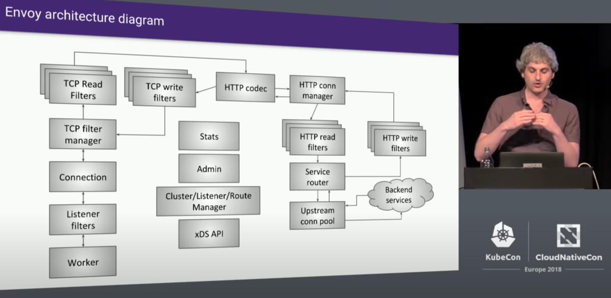

# Envoy Proxy

要深入了解 Istio ，那么先得了解流量的核心 Envoy Proxy。这里有三个认知层次：
1. 了解原生的 可编程代理 `Envoy Proxy` 架构
2. 了解 Istio 的`Istio 定制版 Envoy Proxy`: [github.com/istio/proxy](https://github.com/istio/proxy) 做了什么扩展
3. 了解 istiod 如何编程控制 `Istio 定制版 Envoy Proxy` 以实现服务网格功能

## 原生的可编程代理 `Envoy Proxy` 架构

### 一点历史

```{note}
我不是特别喜欢一天到晚在说大格局，大历史，这些人尽皆知的事。但了解一点，历史，对我们了解现状之因，和预计未来之果，有一定作用。
```


由在 Lyft 工作的 Matt Klein 创建。设计时，其定位就是作为 Service Mesh 中的代理。在 Envoy 的初期，Matt Klein 本人与 Google 的 Istio 的开发团队一直保持很好的合作。可以说，Istio 一直和 Envoy 是共生的关系（虽然现在的 Istio 已经可以用其它代理代替 Envoy）。这也是很多人分不清这两者关系的原因。

#### 为什么用 C++ 实现

“为什么用 C++ 实现？” 这可能是最多起初接触 Envoy 的人最喜欢问的问题之一。随着 Rust/Go 等“安全”/“时尚”的语言流行，人们更不想用这老古董的、学院派的、不安全的语言了。

Matt Klein 的回答是，这是 Envoy 开始时那时，最好的选择。我作为一个20年前比较系统地使用过 C++，但近 20 年都在喝 Java 咖啡的人，浏览过部分 Envoy 代码，觉得 Envoy 使用 C++ 11 的风格已经很 Java 了。代码清晰易懂，没有像一些大师，动不动就故作深奥地写一些魔术代码，让入门者望而却步。这也是开源项目成功的必要素养。


### Envoy Proxy L1 架构

`L1` 即最高层面的架构了，这里不是指 OSI Model 网络分层的 L1 。  
我们先听听 Matt Klein 的说法：

:::{figure-md} Envoy整体架构



*图：Envoy 整体架构*  
*来自：Envoy 原作者 Matt Klein, Lyft 的 [Envoy Internals Deep Dive - Matt Klein, Lyft (Advanced Skill Level)]*
:::

这是数年前的架构图了，不过现在看来变化不大。这里，我先不说明这个 `Envoy内部` 构架图。我想先说说它的周边环境。

```{warning}
需要注意的是，我不打算把 Istio控制面 与 Envoy 完全隔离地分析说明。因为这样的分析现实意义有限。脱离 Istio 说 Envoy，很多时候，就不会明白 Envoy 为何设计成这样。但当我们结合 Istio 使用 Envoy 的场景来说明 Envoy 的设计时，就可以方便了解因由了。
```

## 目录

```{toctree}
:hidden:
envoy@istio-conf-eg.md
envoy-high-level-flow/envoy-high-level-flow.md
envoy@istio-process-level.md
arch/arch.md
req-resp-flow-timeline/req-resp-flow-timeline.md
connection-life/connection-life.md
circuit-breaking/circuit-breaking.md
envoy@istio-metrics/index.md
```