# Socket Options


最近，需要对 k8s cluster + VIP load balance + Istio 的环境做一些 HA / Chaos Testing(混沌测试) 。如下图，在此环境中，需要看看 worker node B 在非正常关机或网络分区的情况下，对外部用户(Client) 的影响：

1. 请求成功率影响
2. 性能(TPS/Response Time)影响


上图需要说明一下：

- 对外部的 VIP(虚拟IP) 的 TCP/IP 层负载均衡，是通过 ECMP(Equal-Cost Multi-Path) 的 [Modulo-N](https://datatracker.ietf.org/doc/html/rfc2992#:~:text=will%20look%20at-,modulo%2DN,-and%0A%20%20%20highest%20random) 算法，分配负载，它本质上就是用 TCP 连接的 5 元组(协议、srcIP、srcPort、dstIP、dstPort)去分配外部流量了。注意，这种负载均衡算法是`无状态`的，在目标数量发生变化时，负载均衡算法的结果也会发生变化。即是`不稳定算法`。
- dstIP 为 VIP 的 TCP 流量，来到 woker node 后，再由 ipvs/conntrack 规则做有状态的，DNAT，dstIP 被映射和转换为任意一个 Istio Gateway POD 的地址。注意，这种负载均衡算法是`有状态`的，在目标数量发生变化时，原有连接的负载均衡结果不会发生变化。即算是`稳定算法`。
- Istio Gateway POD 对 HTTP/TCP 流量也做了负载均衡。两种协议的区别是：
  - 对于 HTTP。同一 downstream(流量发出方) 的一个连接的多个请求，可能被负载均衡到不同的 upstream(流量目标)
  - 对于 TCP。同一 downstream(流量发出方) 的一个连接的多个数据包，会被负载均衡到同一 upstream(流量目标)


## 开始测试

Chaos Testing 的方法是暴力关闭 worker node B 。如上图，可以推断出`红色`与`绿色`线的连接，都会直接影响到。从客户端看到的影响是：

1. 请求成功率只降低了 0.01%
2. TPS 降低了 1/2，持续了半小时后，才恢复回来。
3. Avg Response Time(平均响应时间) 基本不变

需要注意的是，单个 Worker Node 的各类资源不是这个测试的性能瓶颈。那么，问题出现在什么地方？

客户端是个 JMeter 程序，通过细看其产生的测试报告，发现 worker node 关闭后，`Avg Response Time` 是变化不大。但 P99 与 MAX 的 Response Time 变得异常地大。可见，`Avg Response Time` 这东西隐藏了很多东西，测试的线程，很可能是 Block(阻塞)在什么地方了，才导致 TPS 下降。

经过一翻折腾，后来修改了`外部客户端`的 JMeter 的超时时间为 6s，问题解决。 worker node 关闭后， TPS 快速恢复。


## 寻根

外部客户端的问题解决了。就可以收工开饭了。但作为一个爱折腾的人，我想找寻其原因。更想知道，这个情况是真快速恢复了，还是暗藏也什么隐患。

开始前先讲一个概念：

### TCP half-open

> 📖 [TCP half-open](https://en.wikipedia.org/wiki/TCP_half-open)
>
> 根据 RFC 793，当 TCP 连接一端的主机崩溃，或者在没有通知另一端的情况下删除了套接字时，TCP 连接被称为`半打开`。如果半打开端空闲（即无数据/keepalive发送），则连接可能会在无限时间段内保持半打开状态。

在 worker node B 关闭后，从 `外部客户端` 的角度看，如上图，其到 worker node B 的 TCP 连接可能处于两种状态：


- client kernel 层由于发送(或重发) 数据、或闲置到达 keepalive 时间，需要发送数据包到对端。 worker node A 收到这个数据包，由于是不合法的 TCP，所以可能的情况是：
  - 响应了 TCP RESET。client 收到后关闭了连接。client Block(阻塞)在 socket 的线程也因连接被关闭而返回，继续运行且关闭 socket
  - 由于 DNAT 映射表找不到相关的连接，数据包直接 drop 了，不响应。client Block在 socket 的线程继续Block。即发生了`TCP half-open`

-  client 连接没启用 keepalive，或闲置未到达 keepalive 时间，内核层也无数据需要发送(或重发)，client 线程 Block 在 socket read 等待，即发生了`TCP half-open`

可以看到，对于 client 来说，在很大概率下，要发现一个连接已经失效了，均需要一定的时间。在最差的情况下，如没启动 keepalive，可能永远发现不了 `TCP half-open`。


### keepalive

> 来自 [TCP/IP Illustrated Volume 1]
>
> keepalive 探测是一个空的（或 1 字节）`segment(段)`，其序列号比迄今为止从 `对端(peer)` 看到的最大 `ACK` 号小 1。 因为这个序列号已经被 `peer` 接收，`peer` 再收到这个空 `segment` 不会有任何副作用，但它会引发一个 `peer` 返回一个 `ACK`，用于确定`peer`是否存活。 `探测 probe segment` 及其 `ACK` 均不包含任何新数据。
>
> `探测 probe segment` 如果丢失，TCP 也不会重新传输。 [RFC1122] 规定，由于这一事实，单个 `keepalive`  探测收不到 `ACK` 不应被视为对端已死的充分证据。 需要多次间隔探测。

如果 socket 打开了 `SO_KEEPALIVE` ，那么就是启用了 `keepalive`。

对于启用了 `keepalive` 的 TCP连接，Linux 有如下全局默认配置：

> https://www.kernel.org/doc/html/latest/admin-guide/sysctl/net.html

- tcp_keepalive_time - INTEGER

  How often TCP sends out keepalive messages when keepalive is enabled. Default: 2 hours.

- tcp_keepalive_probes - INTEGER

   How many keepalive probes TCP sends out, until it decides that the connection is broken. Default value: 9.

- tcp_keepalive_intvl - INTEGER

  How frequently the probes are send out. Multiplied by tcp_keepalive_probes it is time to kill not responding connection, after probes started. Default value: 75 sec i.e. connection will be aborted after ~11 minutes of retries.

同时，Linux 也提供了为每个 socket 独立指定的配置项：

> https://man7.org/linux/man-pages/man7/tcp.7.html

```
       TCP_KEEPCNT (since Linux 2.4)
              The maximum number of keepalive probes TCP should send
              before dropping the connection.  This option should not be
              used in code intended to be portable.

       TCP_KEEPIDLE (since Linux 2.4)
              The time (in seconds) the connection needs to remain idle
              before TCP starts sending keepalive probes, if the socket
              option SO_KEEPALIVE has been set on this socket.  This
              option should not be used in code intended to be portable.

       TCP_KEEPINTVL (since Linux 2.4)
              The time (in seconds) between individual keepalive probes.
              This option sh
```

可以计算，默认情况 下，一个连接的最快被 keepalive 关闭的时长：

```
TCP_KEEPIDLE + TCP_KEEPINTVL * (TCP_KEEPCNT-1) = 2*60*60 + 75*(9-1) = 7800 = 2 小时
```


### 重传 timeout

> https://www.kernel.org/doc/Documentation/networking/ip-sysctl.txt

```
- tcp_retries2 - INTEGER

This value influences the timeout of an alive TCP connection, when RTO retransmissions remain unacknowledged. Given a value of N, a hypothetical TCP connection following exponential backoff with an initial RTO of TCP_RTO_MIN would retransmit N times before killing the connection at the (N+1)th RTO.The default value of 15 yields a hypothetical timeout of 924.6 seconds and is a lower bound for the effective timeout. TCP will effectively time out at the first RTO which exceeds the hypothetical timeout.RFC 1122 recommends at least 100 seconds for the timeout, which corresponds to a value of at least 8.
```

上面配置项，配置重传状态下，要指数退让多少次重传，内核才关闭连接。默认的配置是 15。计算转换成时间约是 924s，约 15 分钟。

### Zero window timeout

当`对端`通告其窗口大小为零时，这表明对端 TCP 接收缓冲区已满，无法接收更多数据。它可能是由于对端资源紧张而数据处理太慢，最终导致 TCP 接收缓冲区被填满。

理论上，对端在处理完接收窗口中堆积的数据后，会用 ACK 来通知窗口开放。但因各种原因，有时候，这个 ACK 会丢失。

所以，有数据未发出的发送方需要定期探测窗口大小。发送方会从未送达的缓存中，选择头一个字节数据发送作为探测包。当探测超过一定次数，对方不响应，或一直响应0窗口时，连接会自动关闭。Linux 中默认是 15 次。配置项是：`tcp_retries2`。它的探测重试机制和 TCP 重传是类似的。

> 参考：https://blog.cloudflare.com/when-tcp-sockets-refuse-to-die/#:~:text=value%20is%20ignored.-,Zero%20window,-ESTAB%20is...%20forever

### 应用 socket 层的 timeout 设置

#### TCP_USER_TIMEOUT

> [man tcp](https://man7.org/linux/man-pages/man7/tcp.7.html)

```
       TCP_USER_TIMEOUT (since Linux 2.6.37)
              This option takes an unsigned int as an argument.  When
              the value is greater than 0, it specifies the maximum
              amount of time in milliseconds that transmitted data may
              remain unacknowledged, or bufferred data may remain
              untransmitted (due to zero window size) before TCP will
              forcibly close the corresponding connection and return
              ETIMEDOUT to the application.  If the option value is
              specified as 0, TCP will use the system default.

              Increasing user timeouts allows a TCP connection to
              survive extended periods without end-to-end connectivity.
              Decreasing user timeouts allows applications to "fail
              fast", if so desired.  Otherwise, failure may take up to
              20 minutes with the current system defaults in a normal
              WAN environment.

              This option can be set during any state of a TCP
              connection, but is effective only during the synchronized
              states of a connection (ESTABLISHED, FIN-WAIT-1, FIN-
              WAIT-2, CLOSE-WAIT, CLOSING, and LAST-ACK).  Moreover,
              when used with the TCP keepalive (SO_KEEPALIVE) option,
              TCP_USER_TIMEOUT will override keepalive to determine when
              to close a connection due to keepalive failure.

              The option has no effect on when TCP retransmits a packet,
              nor when a keepalive probe is sent.

              This option, like many others, will be inherited by the
              socket returned by accept(2), if it was set on the
              listening socket.

              Further details on the user timeout feature can be found
              in RFC 793 and RFC 5482 ("TCP User Timeout Option").
```

即，指定在发送得不到确认(收不到 `ACK`) ，或对端接收窗口为0 多久后，内核才关闭连接并返回错误给应用。

需要注意的是，`TCP_USER_TIMEOUT` 会影响  keepalive 的 `TCP_KEEPCNT` 配置效果：

> https://blog.cloudflare.com/when-tcp-sockets-refuse-to-die/
>
> With `TCP_USER_TIMEOUT` set, the `TCP_KEEPCNT` is totally ignored. If you want `TCP_KEEPCNT` to make sense, the only sensible `USER_TIMEOUT` value is slightly smaller than:
>
> ```
> TCP_USER_TIMEOUT < TCP_KEEPIDLE + TCP_KEEPINTVL * TCP_KEEPCNT
> ```

#### SO_RCVTIMEO / SO_SNDTIMEO

> https://man7.org/linux/man-pages/man7/socket.7.html

```
       SO_RCVTIMEO and SO_SNDTIMEO
              Specify the receiving or sending timeouts until reporting
              an error.  The argument is a struct timeval.  If an input
              or output function blocks for this period of time, and
              data has been sent or received, the return value of that
              function will be the amount of data transferred; if no
              data has been transferred and the timeout has been
              reached, then -1 is returned with errno set to EAGAIN or
              EWOULDBLOCK, or EINPROGRESS (for connect(2)) just as if
              the socket was specified to be nonblocking.  If the
              timeout is set to zero (the default), then the operation
              will never timeout.  Timeouts only have effect for system
              calls that perform socket I/O (e.g., read(2), recvmsg(2),
              send(2), sendmsg(2)); timeouts have no effect for
              select(2), poll(2), epoll_wait(2), and so on.
```

需要注意的是，本例中，我们的 client 是 JMeter，是 java 实现的，他用了 `socket.setSoTimeout` 方法来设置超时。根据：

> https://stackoverflow.com/questions/12820874/what-is-the-functionality-of-setsotimeout-and-how-it-works

和我看到的源码，Linux 实现上应该是用了下一节说明的 select/poll 的 timeout 参数，而不是上面的 socket Options 。

> https://github.com/openjdk/jdk/blob/4c54fa2274ab842dbecf72e201d5d5005eb38069/src/java.base/solaris/native/libnet/solaris_close.c#L96

Java JMeter 在 catch 到 SocketTimeoutException 后，就主动 close 了 socket。并重连，所以死 socket 的问题是在应用层解决了。

#### poll timeout

> https://man7.org/linux/man-pages/man2/poll.2.html

```c
int poll(struct pollfd *fds, nfds_t nfds, int timeout);
```

### 寻根总结

> 参考：https://blog.cloudflare.com/when-tcp-sockets-refuse-to-die/#:~:text=typical%20applications%20sending%20data%20to%20the%20Internet

要保证连接在各种状态下均可以比较快地检测出超时的情况：

1. 启用 `TCP keepalive`，并配置合理的时间。 这是在空闲连接情况下保持一些数据流动所必需的。
2. 将 `TCP_USER_TIMEOUT` 设置为 `TCP_KEEPIDLE` + `TCP_KEEPINTVL` * `TCP_KEEPCNT`。
3. 在应用层用读写超时检测，并在超时后应用主动关闭连接。（这是本文的情况）

为何有 `TCP keepalive` 了，还要  `TCP_USER_TIMEOUT` ? 原因是如果发生网络分区，重传状态下的连接，是不会触发 keepalive 探测的。我将原理记录到下图：





## 较真有什么用

> 🤔 ❓ 说到这里，有同学会问，说到底，这次，你就是调整了个应用层的读超时就行了。研究和较真那么多其它的干嘛？

这时，我们回到下图的 “初心” 来，看看是不是所有隐患都解决了：


很明显，只解决了 `External Client` 到 `k8s worker node B` 的红线部分。其它红、绿线，没调查过。这些  `tcp half-opent`  连接，是用 `tcp keepalive` 、`tcp retransmit timeout`、`应用(Envoy) 层 timeout` 机制快速关闭了，还是长期未检测到问题而关闭不及时，甚至是连接泄漏(connection leak)？

## 空闲连接的 keepalive 检查

### 作为 upstream(服务端) 时

以下可见， Istio gateway 默认无启用 keepalive:

```bash
$ kubectl exec -it $ISTIO_GATEWAY_POD -- ss -oipn 'sport 15001 or sport 15001 or sport 8080 or sport 8443'                                                         
Netid               State                Recv-Q                Send-Q                               Local Address:Port                               Peer Address:Port                
tcp                 ESTAB                0                     0                                    192.222.46.71:8080                                10.111.10.101:51092                users:(("envoy",pid=45,fd=665))
         sack cubic wscale:11,11 rto:200 rtt:0.064/0.032 mss:8960 pmtu:9000 rcvmss:536 advmss:8960 cwnd:10 segs_in:2 send 11200000000bps lastsnd:31580 lastrcv:31580 lastack:31580 pacing_rate 22400000000bps delivered:1 rcv_space:62720 rcv_ssthresh:56576 minrtt:0.064
```

这时，可以用 EnvoyFilter 加上 keepalive：

> 参考：
>
> https://support.f5.com/csp/article/K00026550
>
> https://www.envoyproxy.io/docs/envoy/latest/api-v3/config/core/v3/socket_option.proto
>
> https://github.com/istio/istio/issues/28879
>
> https://istio-operation-bible.aeraki.net/docs/common-problem/tcp-keepalive/

```yaml
apiVersion: networking.istio.io/v1alpha3
kind: EnvoyFilter
metadata:
  name: ingress-gateway-socket-options
  namespace: istio-system
spec:
  configPatches:
  - applyTo: LISTENER
    match:
      context: GATEWAY
      listener:
        name: 0.0.0.0_8080
        portNumber: 8080
    patch:
      operation: MERGE
      value:
        socket_options:
        - description: enable keep-alive
          int_value: 1
          level: 1
          name: 9
          state: STATE_PREBIND
        - description: idle time before first keep-alive probe is sent
          int_value: 7
          level: 6
          name: 4
          state: STATE_PREBIND
        - description: keep-alive interval
          int_value: 5
          level: 6
          name: 5
          state: STATE_PREBIND
        - description: keep-alive probes count
          int_value: 2
          level: 6
          name: 6
          state: STATE_PREBIND
```

istio-proxy sidecar 也可以用类似的方法设置。


### 作为 downstream(客户端) 时

> 参考：https://istio.io/latest/docs/reference/config/networking/destination-rule/#ConnectionPoolSettings-TCPSettings-TcpKeepalive

```yaml
apiVersion: networking.istio.io/v1alpha3
kind: DestinationRule
metadata:
  name: bookinfo-redis
spec:
  host: myredissrv.prod.svc.cluster.local
  trafficPolicy:
    connectionPool:
      tcp:
        connectTimeout: 30ms
        tcpKeepalive:
          time: 60s
          interval: 20s
          probes: 4
```


## TCP_USER_TIMEOUT

故事说到这里，应该结束了，但，还没有。回顾一下之前的两个图：


这时，retransmit timer 会定时在  TCP 层作重传。这里有两个可能性：

1. Calico 在 worker node B 断电后，快速发现问题，更新了 worker node A 的路由表，删除了到 worker node B 的路由。
2. 未及时更新路由

而默认的 retransmit timer，需要 15 分钟才会关闭连接并通知应用。如何加快？

可以用上文提到的 `TCP_USER_TIMEOUT` 加速 `half-open TCP` 在重传状态下发现问题 :

> https://github.com/istio/istio/issues/33466
>
> https://github.com/istio/istio/issues/38476

```yaml
kind: EnvoyFilter
metadata:
  name: sampleoptions
  namespace: istio-system
spec:
  configPatches:
  - applyTo: CLUSTER
    match:
      context: SIDECAR_OUTBOUND
      cluster:
        name: "outbound|12345||foo.ns.svc.cluster.local"
    patch:
      operation: MERGE
      value:
        upstream_bind_config:
          source_address:
            address: "0.0.0.0"
            port_value: 0
            protocol: TCP
          socket_options:
          - name: 18 #TCP_USER_TIMEOUT
            int_value: 10000
            level: 6
```

上面加速了 die upstream(服务端崩溃) 的发现，对于 die downstream，可能可以用类似的方法，配置在 listener。
