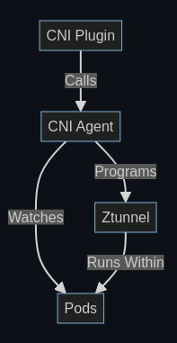

# Istio Ambient 妙用 network namespace 实现跨 pod 集线器


所谓 Sidecarless 的 Istio Ambient ，严格来说，是由 `sidecar container of pod` 变成 `sidecar pod of pods on a worker node`。注意，这里我引入一个词：`sidecar pod`  。 要实现同一 worker node 上的 pod 共享一个 sidecar pod，就要解决把所有 pod 的流量导向到 sidecar pod 的问题。


这个问题的解决方案，在 Istio Ambient 开发过程中经历两个版本：
1. 把 pod 流量经由 worker node 重定向到 `sidecar pod`
1. 让 `sidecar pod` “加入” 到每一个 pod 的 network namespace。流量在 network namespace 内重定向到 `sidecar pod`（pod 流量不需要经由 worker node）


Istio Ambient 的项目组在比较 high level 说明过 Istio Ambient  这个变化的原因：

[Maturing Istio Ambient: Compatibility Across Various Kubernetes Providers and CNIs - By Ben Leggett - Solo.io, Yuval Kohavi - Solo.io, Lin Sun - Solo.io](https://istio.io/latest/blog/2024/inpod-traffic-redirection-ambient/)


Istio Ambient 官方文档也有说明最新的实现：

- [Istio’s in-pod traffic redirection model](https://istio.io/latest/docs/ambient/architecture/traffic-redirection/)
- [ztunnel 流量重定向](https://istio.io/latest/zh/docs/ambient/architecture/traffic-redirection/)


本文尝试从 low level 补充说明一下这个流量环境的 setup 过程实现细节和相关的背景技术。以记录我的好奇心。也希望能满足小部分读者的好奇心。


## kernel 基本原理

“kernel 基本原理” 这节有太多 TL;DR 的背景知识，因这我写这篇文章时，发觉要说明白这个主题的确有点烧脑。如果你只想知道结果，请直接跳到 “ Istio Ambient 的奇技\*巧” 部分。

### network namespace 基本原理

[Few notes about network namespaces in Linux](https://sgros.blogspot.com/2016/02/few-notes-about-network-namespaces-in.html) 一文中说了：

> ##### Kernel API for NETNS
>
> Kernel offers two system calls that allow management of network namespaces. 
>
> - The first one is for creating a new network namespace, [unshare(2)](http://linux.die.net/man/2/unshare). The first approach is for the process that created new network namespace to fork other processes and each forked process would share and inherit the parent's process network namespace. The same is true if exec is used.
>
> 
>
> - The second system call kernel offers is [setns(int fd, int nstype)](http://man7.org/linux/man-pages/man2/setns.2.html). To use this system call you have to have a `file descriptor` that is somehow related to the network namespace you want to use. There are two approaches how to obtain the file descriptor.
>
>   The first approach is to know the process that lives currently in the required network namespace. Let's say that the PID of the given process is $PID. So, to obtain file descriptor you should **open** the file `/proc/$PID/ns/net` file and that's it, pass file descriptor to `setns(2)` system call to switch network namespace. This approach always works.
>
>   Also, to note is that network namespace is per-thread setting, meaning if you set certain network namespace in one thread, this won't have any impact on other threads in the process.
>
>   注意：[setns(int fd, int nstype)](http://man7.org/linux/man-pages/man2/setns.2.html) 中也说了：
>
>   > The setns() system call allows the calling **thread** to move into different namespaces
>
>   注意是 thead(线程)，不是整个 process(进程)。这点非常非常重要！
>
>   The second approach works only for iproute2 compatible tools. Namely, `ip` command when creating new network namespace creates a file in /var/run/netns directory and bind mounts new network namespace to this file. So, if you know a name of network namespace you want to access (let's say the name is NAME), to obtain file descriptor you just need to open(2) related file, i.e. /var/run/netns/NAME.
>
>   Note that there is no system call that would allow you to remove some existing network namespace. Each network namespace exists as long as there is at least one process that uses it, or there is a mount point.
>
>   上面说了那么多，本文想引用的重点是 [setns(int fd, int nstype)](http://man7.org/linux/man-pages/man2/setns.2.html) 可以为调用的线程切换 `线程的当前 network namespace` 。
>
>   #### Socket API behavior
>
> First, **each socket handle you create is bound to whatever network namespace was active at the time the socket was created**. That means that you can set one network namespace to be active (say NS1) create socket and then immediately set another network namespace to be active (NS2). The socket created is bound to NS1 no matter which network namespace is active and socket can be used normally. In other words, when doing some operation with the socket (let's say bind, connect, anything) you don't need to activate socket's own network namespace before that!
>


上面说了那么多，本文想引用的重点是 socket 其实有自己绑定的 network namespace，这个绑定发生在 socket 被创建时，它不由创建者线程的当前 network namespace 的改变而改变。


如果你对 network namespace 了解不多，可以看看：

- [A deep dive into Linux namespaces, part 4](https://ifeanyi.co/posts/linux-namespaces-part-4/)

- [Unprivileged Linux Network Namespaces, Part 1](https://blog.0x1b.me/posts/unprivileged-linux-netns-pt1/)

- [Deep dive into Linux network namespace - kernel source code level](https://hustcat.github.io/deep-dive-into-net-namespace/)


### 用 Unix Domain Sockets 在进程间传递 File Descriptor


使用 Unix Domain Sockets 可以在进程间传递 File Descriptor ：[File Descriptor Transfer over Unix Domain Sockets](https://copyconstruct.medium.com/file-descriptor-transfer-over-unix-domain-sockets-dcbbf5b3b6ec)


新 kernel (5.6以上)的新方法  : [Seamless file descriptor transfer between processes with pidfd and pidfd_getfd](https://copyconstruct.medium.com/seamless-file-descriptor-transfer-between-processes-with-pidfd-and-pidfd-getfd-816afcd19ed4)

一些参考：

- [pidfd_open(2) — Linux manual page](https://man7.org/linux/man-pages/man2/pidfd_open.2.html)

- [pidfd_getfd(2) — Linux manual page](https://man7.org/linux/man-pages/man2/pidfd_getfd.2.html)

- [Grabbing file descriptors with pidfd_getfd()](https://lwn.net/Articles/808997/)


## Istio Ambient 的奇技\*巧

前面说了那么多铺垫，现在终于开始说 Istio Ambient  的 put it all together 的奇技\*巧了。注意，这里的 “奇技\*巧” 用作褒义词。


[Ztunnel Lifecyle On Kubernetes](https://github.com/istio/istio/blob/master/architecture/ambient/ztunnel-cni-lifecycle.md) 中说了 high level 的设计：


> 

> The CNI Plugin is a binary installed as a [CNI plugin](https://kubernetes.io/docs/concepts/extend-kubernetes/compute-storage-net/network-plugins/) on the node. The container runtime is responsible for invoking this when a Pod is being started (before the containers run). When this occurs, the plugin will call out to the CNI Agent to program the network. This includes setting up networking rules within both the pod network namespace and the host network. For more information on the rules, see the [CNI README](https://github.com/istio/istio/blob/master/cni/README.md). This is done by an HTTP server running on `/var/run/istio-cni/pluginevent.sock`.
>
> An alternative flow is when a pod is enrolled into ambient mode after it starts up. In this case, the CNI Agent is watching for Pod events from the API server directly and performing the same setup. Note this is done while the Pod is running, unlike the CNI plugin flow which occurs before the Pod starts.
>
> Once the network is configured, the CNI Agent will signal to Ztunnel to start running within the Pod. This is done by the [ZDS](https://github.com/istio/istio/blob/master/pkg/zdsapi/zds.proto) API. This will send some identifying information about the Pod to Ztunnel, and, importantly, the **Pod's network namespace file descriptor.**
>
> **Ztunnel will use this to enter the Pod network namespace and start various listeners (inbound, outbound, etc).**
>
> Note:
>
> **While Ztunnel runs as a single shared binary on the node, each individual pod gets its own unique set of listeners within its own network namespace.**


:::{figure-md} 图：Istio CNI and Istio ztunnel sync pod network namespace high level


*图：Istio CNI and Istio ztunnel sync pod network namespace high level*
:::
*[用 Draw.io 打开](https://app.diagrams.net/?ui=sketch#Uhttps%3A%2F%2Fistio-insider.mygraphql.com%2Fzh_CN%2Flatest%2F_images%2Fistio-cni-ztunnel-high-level.drawio.svg)*


图中已经较大信息量了，不再写太多文字说明了 :)


下面是一些实现细节：


:::{figure-md} 图：Istio CNI and Istio ztunnel sync pod network namespace


*图：Istio CNI and Istio ztunnel sync pod network namespace*
:::
*[用 Draw.io 打开](https://app.diagrams.net/?ui=sketch#Uhttps%3A%2F%2Fistio-insider.mygraphql.com%2Fzh_CN%2Flatest%2F_images%2Fztunnel-inpod-net-ns-hub.drawio.svg)*


图中已经较大信息量了，这个博客的旧读者也知道，我不会写太多文字说明了 :)


## ztunnel 的封装


[InpodNetns::run(...)](https://github.com/istio/ztunnel/blob/d80323823cfd3afb3304c642682684c6752dda2d/src/inpod/netns.rs#L78)

```rust
//src/inpod/netns.rs

pub struct NetnsID {
    pub inode: libc::ino_t,
    pub dev: libc::dev_t,
}

struct NetnsInner {
    cur_netns: Arc<OwnedFd>,
    netns: OwnedFd,
    netns_id: NetnsID,
}

pub struct InpodNetns {
    inner: Arc<NetnsInner>,
}

impl InpodNetns {
    pub fn run<F, T>(&self, f: F) -> std::io::Result<T>
    where
        F: FnOnce() -> T,
    {
        setns(&self.inner.netns, CloneFlags::CLONE_NEWNET)
            .map_err(|e| std::io::Error::from_raw_os_error(e as i32))?;
        let ret = f();
        setns(&self.inner.cur_netns, CloneFlags::CLONE_NEWNET).expect("this must never fail");
        Ok(ret)
    }
```

[InPodSocketFactory::run_in_ns(...)](https://github.com/istio/ztunnel/blob/d80323823cfd3afb3304c642682684c6752dda2d/src/inpod/config.rs#L68-L69)

```rust
//src/inpod/config.rs

pub struct DefaultSocketFactory;

impl SocketFactory for DefaultSocketFactory {
    fn new_tcp_v4(&self) -> std::io::Result<TcpSocket> {
        TcpSocket::new_v4().and_then(|s| {
            s.set_nodelay(true)?;
            Ok(s)
        })
    }
}

impl InPodSocketFactory {

    fn run_in_ns<S, F: FnOnce() -> std::io::Result<S>>(&self, f: F) -> std::io::Result<S> {
        self.netns.run(f)?
    }

    fn configure<S: std::os::unix::io::AsFd, F: FnOnce() -> std::io::Result<S>>(
        &self,
        f: F,
    ) -> std::io::Result<S> {
        let socket = self.netns.run(f)??;

        if let Some(mark) = self.mark {
            crate::socket::set_mark(&socket, mark.into())?;
        }
        Ok(socket)
    }   
    ...
}


impl crate::proxy::SocketFactory for InPodSocketFactory {
    fn new_tcp_v4(&self) -> std::io::Result<tokio::net::TcpSocket> {
        self.configure(|| DefaultSocketFactory.new_tcp_v4())
    }

    fn tcp_bind(&self, addr: std::net::SocketAddr) -> std::io::Result<socket::Listener> {
        let std_sock = self.configure(|| std::net::TcpListener::bind(addr))?;
        std_sock.set_nonblocking(true)?;
        tokio::net::TcpListener::from_std(std_sock).map(socket::Listener::new)
    }
}
```


参见：

- [std::net::TcpListener::bind(addr) 的文档](https://doc.rust-lang.org/std/net/struct.TcpListener.html#method.bind)


[Inbound](https://github.com/istio/ztunnel/blob/d80323823cfd3afb3304c642682684c6752dda2d/src/proxy/inbound.rs#L62)

```rust
//src/proxy/inbound.rs

impl Inbound {
    pub(super) async fn new(pi: Arc<ProxyInputs>, drain: DrainWatcher) -> Result<Inbound, Error> {
        let listener = pi
            .socket_factory
            .tcp_bind(pi.cfg.inbound_addr)
            .map_err(|e| Error::Bind(pi.cfg.inbound_addr, e))?;
        let enable_orig_src = super::maybe_set_transparent(&pi, &listener)?;
```

[InPodConfig](https://github.com/istio/ztunnel/blob/d80323823cfd3afb3304c642682684c6752dda2d/src/inpod/config.rs#L39)

```rust
//src/inpod/config.rs

impl InPodConfig {
    pub fn new(cfg: &config::Config) -> std::io::Result<Self> {
        Ok(InPodConfig {
            cur_netns: Arc::new(InpodNetns::current()?),
            mark: std::num::NonZeroU32::new(cfg.packet_mark.expect("in pod requires packet mark")),
            reuse_port: cfg.inpod_port_reuse,
        })
    }
    pub fn socket_factory(
        &self,
        netns: InpodNetns,
    ) -> Box<dyn crate::proxy::SocketFactory + Send + Sync> {
        let sf = InPodSocketFactory::from_cfg(self, netns);
        if self.reuse_port {
            Box::new(InPodSocketPortReuseFactory::new(sf))
        } else {
            Box::new(sf)
        }
    }
```


如果你好奇 ztunnel 有哪些 listener ，可以看： [ztunnel Architecture](https://github.com/istio/ztunnel/blob/master/ARCHITECTURE.md)


## Istio CNI

[ztunnelserver.go](https://github.com/istio/istio/blob/afdad15000541f1a4c82f58918868511553e1a87/cni/pkg/nodeagent/#L460)

```go
func (z *ZtunnelConnection) sendDataAndWaitForAck(data []byte, fd *int) (*zdsapi.WorkloadResponse, error) {
	var rights []byte
	if fd != nil {
		rights = unix.UnixRights(*fd)
	}
	err := z.u.SetWriteDeadline(time.Now().Add(readWriteDeadline))
	if err != nil {
		return nil, err
	}

	_, _, err = z.u.WriteMsgUnix(data, rights, nil)
	if err != nil {
		return nil, err
	}

	// wait for ack
	return z.readMessage(readWriteDeadline)
}
```


参见：

- [Istio CNI Node Agent](https://github.com/istio/istio/blob/master/cni/README.md)
- [源码解析：K8s 创建 pod 时，背后发生了什么（五）（2021）](https://arthurchiao.art/blog/what-happens-when-k8s-creates-pods-5-zh/)
- [Experiments with container networking: Part 1](https://logingood.github.io/kubernetes/cni/2016/05/14/netns-and-cni.html)


## 结语

“奇技\*巧” over engineering 了吗？这个问题，我没的答案。所谓的 over engineering ，大部分是事后诸葛亮的评价。如果你成事了，软件影响力大了，就叫 it is a feature not a  bug，否则，就叫： it is a bug not a feature.


> Overengineering (or over-engineering) is **the act of designing a product or providing a solution to a problem that is complicated in a way that provides no value or could have been designed to be simpler**.
>
> -- [Overengineering - Wikipedia](https://en.wikipedia.org/wiki/Overengineering#:~:text=Overengineering (or over-engineering),been designed to be simpler.)


## 参考

- [Testing a Kubernetes Networking Implementation Without Kubernetes - howardjohn's blog](https://blog.howardjohn.info/posts/ztunnel-testing/)
- [Istio Ambient is not a "Node Proxy" - howardjohn's blog](https://blog.howardjohn.info/posts/ambient-not-node-proxy/)
- [NSocker the namespaced socket server](https://github.com/rkapl/nsocker)


