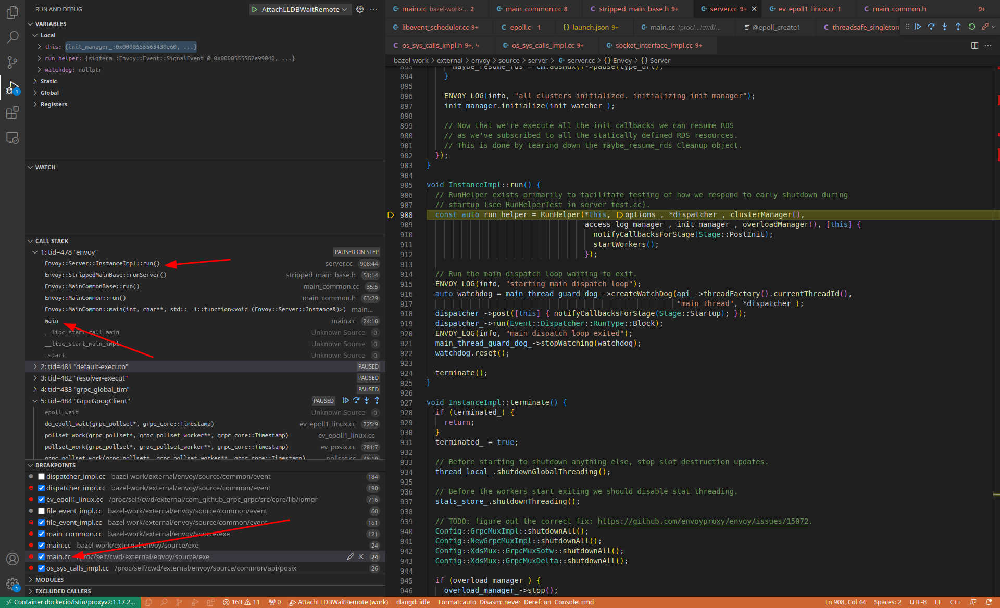

# 调试与观察 istio-proxy Envoy sidecar 的启动过程


学习 Istio 下 Envoy sidecar 的初始化过程，有助于理解 Envoy 是如何构建起整个事件驱动和线程互动体系的。其中 Listener socket 事件监初始化是重点。而获取这个知识最直接的方法是 debug Envoy 启动初始化过程，这样可以直接观察运行状态的 Envoy 代码，而不是直接读无聊的 OOP 代码去猜现实行为。但要 debug sidecar 初始化有几道砍要过。本文记录了我通关打怪的过程。


> 本文基于我之前写的：[《调试 Istio 网格中运行的 Envoy sidecar C++ 代码》](https://blog.mygraphql.com/zh/posts/cloud/istio/debug-istio-proxy/)。你可能需要看看前者的背景，才比较容易读懂本文。


## debug 初始化之难

有经验的程序员都知道，debug 的难度和要 debug 的目标场景出现频率成反比。而 sidecar 的初始化只有一次。

要 debug istio-proxy(Envoy) 的启动过程，需要经过几道砍：

 1. Istio auto inject sidecar 在容器启动时就自动启动 Envoy，很难在初始化前完成 remote debug attach 和 breakpoint 设置。
 2. `/usr/local/bin/pilot-agent` 负责运行 `/usr/local/bin/envoy` 进程，并作为其父进程，即不可以直接控制 envoy 进程的启动。

下面我解释一下如何避坑。


## Envoy 的启动 attach 方法

下面研究一下，两种场景下，Envoy 的启动 attach 方法：

1. Istio auto inject 的 istio-proxy container (我没有使用这种方法，见附录部分)
2. 手工 inject 的 istio-proxy container (我使用这种方法)


### 手工 inject 的 istio-proxy container

要方便精准地在 envoy 开始初始化前 attach envoy 进程，一个方法是不要在容器启动时自动启动 envoy。要手工启动  `pilot-agent`，一个方法是不要 auto inject sidecar，用 `istioctl` 手工 inject：

#### 1. 定制手工拉起的 istio-proxy 环境

```bash
# fortio-server.yaml 是定义 pod 的 k8s StatefulSet/deployment
$ ./istioctl kube-inject -f fortio-server.yaml > fortio-server-injected.yaml
```


```yaml
$ vi fortio-server-injected.yaml

apiVersion: apps/v1
kind: StatefulSet
metadata:
  creationTimestamp: null
  labels:
    app: fortio-server
  name: fortio-server
spec:
  replicas: 1
  selector:
    matchLabels:
      app: fortio-server
  serviceName: fortio-server
  template:
    metadata:
      annotations:
        kubectl.kubernetes.io/default-container: main-app
        kubectl.kubernetes.io/default-logs-container: main-app
        prometheus.io/path: /stats/prometheus
        prometheus.io/port: "15020"
        prometheus.io/scrape: "true"
        sidecar.istio.io/proxyImage: 192.168.122.1:5000/proxyv2:1.17.2-debug
        sidecar.istio.io/inject: "false" #加入这行
      creationTimestamp: null
      labels:
        app: fortio-server
        app.kubernetes.io/name: fortio-server
        security.istio.io/tlsMode: istio
        service.istio.io/canonical-name: fortio-server
        service.istio.io/canonical-revision: latest
    spec:
      containers:
      - args:
        - 10d
        command:
        - /bin/sleep #不启动 pilot-agent
        image: docker.io/nicolaka/netshoot:latest
        imagePullPolicy: IfNotPresent
        name: main-app
        ports:
        - containerPort: 8080
          name: http
          protocol: TCP
        resources: {}
      - args:
        - 20d
        command:
        - /usr/bin/sleep
        env:
        - name: JWT_POLICY
          value: third-party-jwt
        - name: PILOT_CERT_PROVIDER
          value: istiod
        - name: CA_ADDR
          value: istiod.istio-system.svc:15012
        - name: POD_NAME
          valueFrom:
            fieldRef:
              fieldPath: metadata.name
        - name: POD_NAMESPACE
          valueFrom:
            fieldRef:
              fieldPath: metadata.namespace
        - name: INSTANCE_IP
          valueFrom:
            fieldRef:
              fieldPath: status.podIP
        - name: SERVICE_ACCOUNT
          valueFrom:
            fieldRef:
              fieldPath: spec.serviceAccountName
        - name: HOST_IP
          valueFrom:
            fieldRef:
              fieldPath: status.hostIP
        - name: PROXY_CONFIG
          value: |
            {}
        - name: ISTIO_META_POD_PORTS
          value: |-
            [
                {"name":"http","containerPort":8080,"protocol":"TCP"}
                ,{"name":"http-m","containerPort":8070,"protocol":"TCP"}
                ,{"name":"grpc","containerPort":8079,"protocol":"TCP"}
            ]
        - name: ISTIO_META_APP_CONTAINERS
          value: main-app
        - name: ISTIO_META_CLUSTER_ID
          value: Kubernetes
        - name: ISTIO_META_NODE_NAME
          valueFrom:
            fieldRef:
              fieldPath: spec.nodeName
        - name: ISTIO_META_INTERCEPTION_MODE
          value: REDIRECT
        - name: ISTIO_META_MESH_ID
          value: cluster.local
        - name: TRUST_DOMAIN
          value: cluster.local
        image: 192.168.122.1:5000/proxyv2:1.17.2-debug
        name: istio-proxy
        ports:
        - containerPort: 15090
          name: http-envoy-prom
          protocol: TCP
        - containerPort: 2159
          name: http-m
          protocol: TCP
        resources:
          requests:
            cpu: 100m
            memory: 128Mi
        securityContext:
          allowPrivilegeEscalation: true
          capabilities:
            add:
            - ALL
          privileged: true
          readOnlyRootFilesystem: false
          runAsGroup: 1337
          runAsNonRoot: true
          runAsUser: 1337
        volumeMounts:
        - mountPath: /var/run/secrets/workload-spiffe-uds
          name: workload-socket
        - mountPath: /var/run/secrets/credential-uds
          name: credential-socket
        - mountPath: /var/run/secrets/workload-spiffe-credentials
          name: workload-certs
        - mountPath: /var/run/secrets/istio
          name: istiod-ca-cert
        - mountPath: /var/lib/istio/data
          name: istio-data
        - mountPath: /etc/istio/proxy
          name: istio-envoy
        - mountPath: /var/run/secrets/tokens
          name: istio-token
        - mountPath: /etc/istio/pod
          name: istio-podinfo
      restartPolicy: Always
      volumes:
      - name: workload-socket
      - name: credential-socket
      - name: workload-certs
      - emptyDir:
          medium: Memory
        name: istio-envoy
      - emptyDir: {}
        name: istio-data
      - downwardAPI:
          items:
          - fieldRef:
              fieldPath: metadata.labels
            path: labels
          - fieldRef:
              fieldPath: metadata.annotations
            path: annotations
        name: istio-podinfo
      - name: istio-token
        projected:
          sources:
          - serviceAccountToken:
              audience: istio-ca
              expirationSeconds: 43200
              path: istio-token
      - configMap:
          name: istio-ca-root-cert
        name: istiod-ca-cert
  updateStrategy: {}
status:
  availableReplicas: 0
  replicas: 0
```


```bash
$ kubectl apply -f fortio-server-injected.yaml  
```

为避免 kubectl exec 在容器中启动进程的意外退出，和可以多次接入同一个 shell 实例，我使用了 `tmux`：

```bash
kubectl exec -it fortio-server-0 -c istio-proxy -- bash
sudo apt install -y tmux
```

我只希望一个 app(uid=1000) 用户的 outbound 流量流经 envoy，其它 outbound 流量不经过 envoy：


```bash
kubectl exec -it fortio-server-0 -c main-app -- bash

adduser -u 1000 app
```


```bash
kubectl exec -it fortio-server-0 -c istio-proxy -- bash
tmux #开启 tmux server

sudo iptables-restore <<"EOF"
*nat
:PREROUTING ACCEPT [8947:536820]
:INPUT ACCEPT [8947:536820]
:OUTPUT ACCEPT [713:63023]
:POSTROUTING ACCEPT [713:63023]
:ISTIO_INBOUND - [0:0]
:ISTIO_IN_REDIRECT - [0:0]
:ISTIO_OUTPUT - [0:0]
:ISTIO_REDIRECT - [0:0]
-A PREROUTING -p tcp -j ISTIO_INBOUND
-A OUTPUT -p tcp -j ISTIO_OUTPUT
-A ISTIO_INBOUND -p tcp -m tcp --dport 15008 -j RETURN
-A ISTIO_INBOUND -p tcp -m tcp --dport 15090 -j RETURN
-A ISTIO_INBOUND -p tcp -m tcp --dport 15021 -j RETURN
-A ISTIO_INBOUND -p tcp -m tcp --dport 15020 -j RETURN
# do not redirect remote lldb inbound
-A ISTIO_INBOUND -p tcp -m tcp --dport 2159 -j RETURN
-A ISTIO_INBOUND -p tcp -j ISTIO_IN_REDIRECT
-A ISTIO_IN_REDIRECT -p tcp -j REDIRECT --to-ports 15006
-A ISTIO_OUTPUT -s 127.0.0.6/32 -o lo -j RETURN
-A ISTIO_OUTPUT ! -d 127.0.0.1/32 -o lo -m owner --uid-owner 1337 -j ISTIO_IN_REDIRECT
-A ISTIO_OUTPUT -o lo -m owner ! --uid-owner 1337 -j RETURN
-A ISTIO_OUTPUT -m owner --uid-owner 1337 -j RETURN
# only redirct app user outbound
-A ISTIO_OUTPUT -m owner ! --uid-owner 1000 -j RETURN
-A ISTIO_OUTPUT ! -d 127.0.0.1/32 -o lo -m owner --gid-owner 1337 -j ISTIO_IN_REDIRECT
-A ISTIO_OUTPUT -o lo -m owner ! --gid-owner 1337 -j RETURN
# only redirct app user outbound 
-A ISTIO_OUTPUT -m owner ! --gid-owner 1000 -j RETURN
-A ISTIO_OUTPUT -m owner --gid-owner 1337 -j RETURN
-A ISTIO_OUTPUT -d 127.0.0.1/32 -j RETURN
-A ISTIO_OUTPUT -j ISTIO_REDIRECT
-A ISTIO_REDIRECT -p tcp -j REDIRECT --to-ports 15001
COMMIT
EOF

```


#### 2. 启动 remote debug server 与 vscode debug session


在 isto-proxy 运行的 worker node 上启动 remote debug server:

```bash
ssh labile@192.168.122.55 #  ssh 到运行 istio-proxy 的 worker node

# 获取 istio-proxy 容器内一个进程的 PID
export POD="fortio-server-0"
ENVOY_PIDS=$(pgrep sleep) #容器中有个叫 /usr/bin/sleep 的进程
while IFS= read -r ENVOY_PID; do
    HN=$(sudo nsenter -u -t $ENVOY_PID hostname)
    if [[ "$HN" = "$POD" ]]; then # space between = is important
        sudo nsenter -u -t $ENVOY_PID hostname
        export POD_PID=$ENVOY_PID
    fi
done <<< "$ENVOY_PIDS"
echo $POD_PID
export PID=$POD_PID

# 启动 remote debug server
sudo nsenter -t $PID -u -p -m bash -c 'lldb-server platform --server --listen *:2159' #注意没有 -n: 
```


> 为何不使用 kubectl port forward?
>
> 我尝试过：
>
> ```bash
> kubectl port-forward --address 0.0.0.0 pods/fortio-server-0 2159:2159
> ```
>
> 可能由于 debug 的流量很大，forward 很不稳定。


在 `lldb-vscode-server` 的 `.vscode/launch.json` 文件中，加入一个 debug 配置：

```json
{
    "version": "0.2.0",
    "configurations": [
		{
            "name": "AttachLLDBWaitRemote",
            "type": "lldb",
            "request": "attach",
            "program": "/usr/local/bin/envoy",
            // "stopOnEntry": true,
            "waitFor": true,
            "sourceMap": {
                "/proc/self/cwd": "/work/bazel-work",
                "/home/.cache/bazel/_bazel_root/1e0bb3bee2d09d2e4ad3523530d3b40c/sandbox/linux-sandbox/263/execroot/io_istio_proxy": "/work/bazel-work"
            },
            "initCommands": [
                // "log enable lldb commands",
                "platform select remote-linux", // Execute `platform list` for a list of available remote platform plugins.
                "platform connect connect://192.168.122.55:2159",
            ],                              
        } 
```

然后在 vscode 中启动 AttachLLDBWaitRemote 。这将与 lldb-server 建立连接，并分析 `/usr/local/bin/envoy`。由于这是一个 1GB 的 ELF，这步在我的机器中用了 100% CPU 和 16GB RSS 内存，耗时 1 分钟以上。完成后，可见 istio-proxy 中有一个 100% CPU 占用的 `lldb-server` 进程，其实就是 `"waitFor": true` 命令 lldb-server 不断扫描进程列表。


##### 2.1 设置断点

你可以在设置断点在你的兴趣点上，我是：

`envoy/source/exe/main.cc` 即：`Envoy::MainCommon::main(...)`


#### 3. 启动 pilot-agent 和 envoy

``` bash
kubectl exec -it fortio-server-0 -c istio-proxy -- bash

tmux a #连接上之前启动的 tmux server

/usr/local/bin/pilot-agent proxy sidecar --domain ${POD_NAMESPACE}.svc.cluster.local --proxyLogLevel=warning --proxyComponentLogLevel=misc:error --log_output_level=default:info --concurrency 2


2023-06-05T08:04:25.267206Z     info    Effective config: binaryPath: /usr/local/bin/envoy
concurrency: 2
configPath: ./etc/istio/proxy
controlPlaneAuthPolicy: MUTUAL_TLS
discoveryAddress: istiod.istio-system.svc:15012
drainDuration: 45s
proxyAdminPort: 15000
serviceCluster: istio-proxy
statNameLength: 189
statusPort: 15020
terminationDrainDuration: 5s
tracing:
  zipkin:
    address: zipkin.istio-system:9411
...
2023-06-05T08:04:25.754381Z     info    Starting proxy agent
2023-06-05T08:04:25.755875Z     info    starting
2023-06-05T08:04:25.758098Z     info    Envoy command: [-c etc/istio/proxy/envoy-rev.json --drain-time-s 45 --drain-strategy immediate --local-address-ip-version v4 --file-flush-interval-msec 1000 --disable-hot-restart --allow-unknown-static-fields --log-format %Y-%m-%dT%T.%fZ       %l      envoy %n %g:%#  %v      thread=%t -l warning --component-log-level misc:error --concurrency 2]
```


#### 4. 开始 debug

这时，lldb-server 会扫描到 envoy 进程的启动，并 attach 和 挂起 envoy 进程，然后通知到 vscode。vscode 设置断点，然后继续 envoy 的运行，然后进程跑到断点， vscode 反馈到 GUI:





### 常用断点

以下是一些我常用的断点：

```
# Envoy 直接调用的系统调用 syscall
breakpoint set --func-regex .*OsSysCallsImpl.*

# libevent 的 syscall
breakpoint set --shlib libc.so.6 --func-regex 'epoll_create.*|epoll_wait|epoll_ctl'

breakpoint set --shlib libc.so.6 --basename 'epoll_create'
breakpoint set --shlib libc.so.6 --basename 'epoll_create1'
breakpoint set --shlib libc.so.6 --basename 'epoll_wait'
breakpoint set --shlib libc.so.6 --basename 'epoll_ctl'
```


## 附录 - 写给自己的一些备忘


### Istio auto inject 的 sidecar container  (我没有使用这种方法)

做过 k8s 运维的同学都知道，一个时常遇到，但又缺少非入侵方法定位的问题是：容器启动时出错。很难有办法让出错的启动进程暂停下来，留充足的时间，让人工进入环境中去做 troubleshooting。而 gdb/lldb 这类 debuger 天生就有这种让任意进程挂起的 “魔法”。


对于 Istio auto inject 的 sidecar container，是很难在 envoy 初始化前 attach 到刚启动的 envoy 进程的。理论上有几个可能的方法（**注意：我未测试过**）：


-  在 worker node 上 Debugger wait process

-  debugger follow process fork

-  debugger wrapper script


下面简单说明一下理论。

#### 在 worker node 上 Debugger wait process

在 worker node 上，让 gdb/lldb 不断扫描进程列表，发现 envoy 立即 attach

对于 gdb， [网上](https://stackoverflow.com/a/11147567) 有个 script:

```bash
#!/bin/sh
# 以下脚本启动前，要求 worker node 下未有 envoy 进程运行
progstr=envoy
progpid=`pgrep -o $progstr`
while [ "$progpid" = "" ]; do
  progpid=`pgrep -o $progstr`
done
gdb -ex continue -p $progpid
```

对于 本文的主角 lldb，有内置的方法：

```
(lldb) process attach --name /usr/local/bin/envoy --waitfor
```

这个方法缺点是 debugger(gdb/lldb) 与 debuggee(envoy) 运行在不同的 pid namespace 和 mount namespace，会让 debugger 发生很多奇怪的问题，所以不建议使用。


#### Debugger follow process fork

我们知道：

-  `envoy` 进程由容器的 pid 1 进程（这里为 `pilot-agent`）启动
-  `pilot-agent` 由短命进程 `runc` 启动
-  `runc` 由 `/usr/local/bin/containerd-shim-runc-v2` 启动
-  `containerd-shim-runc-v2` 由 `/usr/local/bin/containerd` 启动

> 参考：https://iximiuz.com/en/posts/implementing-container-runtime-shim/


只要用 debugger 跟踪 containerd ，一步步 follow process fork 就可以跟踪到 exec /usr/local/bin/envoy 。


对于 gdb 可以用

```
(gdb) set follow-fork-mode child
```

> 参见：
>
> [https://visualgdb.com/gdbreference/commands/set_follow-fork-mode](https://visualgdb.com/gdbreference/commands/set_follow-fork-mode)


对于 lldb 可以用：

```
(lldb) settings set target.process.follow-fork-mode child
```

> 参见：
>
> - [Debugging binaries invoked from scripts with GDB](https://developers.redhat.com/articles/2022/12/27/debugging-binaries-invoked-scripts-gdb#)
> - [LLDB support for fork(2) and vfork(2)](https://www.moritz.systems/blog/lldb-support-for-fork-and-vfork/)
> - [LLDB Improvements Part II – Additional CPU Support, Follow-fork operations, and SaveCore Functionality](https://freebsdfoundation.org/project/lldb-improvements-part-ii-additional-cpu-support-follow-fork-operations-and-savecore-functionality/#fromHistory)
> - [lldb equivalent of gdb's "follow-fork-mode" or "detach-on-fork"](https://stackoverflow.com/questions/19204395/lldb-equivalent-of-gdbs-follow-fork-mode-or-detach-on-fork#:~:text=lldb%20does%20not%20currently%20support,process%20with%20the%20given%20name.#fromHistory)


#### Debugger wrapper script

我们没办法直接修改 `pilot-agent` 注入 debugger，但可以用一个 `wrapper script` 替换 `/usr/local/bin/envoy`，然后由这个`wrapper script`  启动 debugger , 让 debugger 启动 真正的 envoy ELF。

可以通过修改 istio-proxy docker image 的方法，去实现：

如：

```bash
mv /usr/local/bin/envoy /usr/local/bin/real_envoy_elf
vi /usr/local/bin/envoy
...
chmod +x /usr/local/bin/envoy
```


`/usr/local/bin/envoy` 写成这样：

```bash
#!/bin/bash

# This is a gdb wrapper script.
# Get the arguments passed to the script.
args=$@
# Start gdb.
gdb -ex=run --args /usr/local/bin/real_envoy_elf $args
```


### 流量 debug

发起一些 经过 envoy 的 outbound 流量：

```bash
kubectl exec -it fortio-server-0 -c main-app -- bash

su app
curl -v www.baidu.com
```


### lldb 常用命令单

```
lldb
(lldb) process attach --name pilot-agent --waitfor
(lldb) platform process attach --name envoy --waitfor
```

