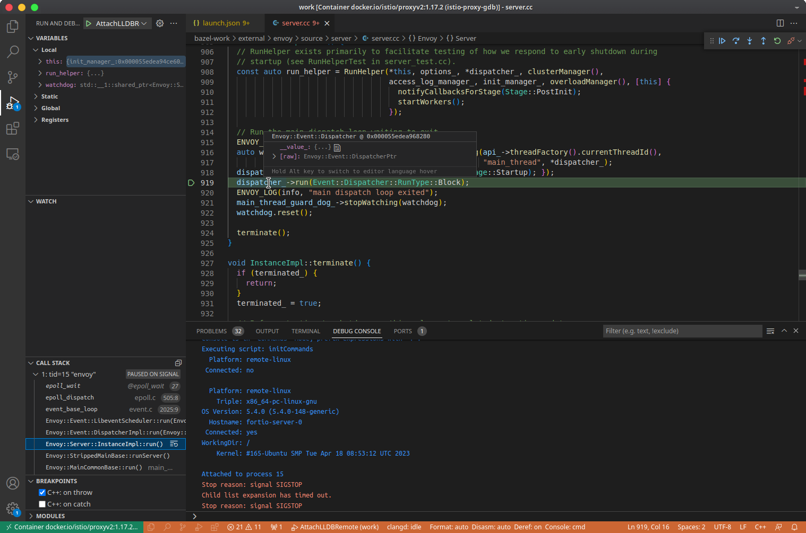

# 调试 Istio 网格中运行的 Envoy sidecar C++ 代码

## 介绍

调试在 Istio 网格中运行的 Envoy sidecar C++ 代码。 它有助于在代码级别深入研究 sidecar。 它使我们在解决 Istio 问题或编写更好的 EnvoyFilter 或 eBPF 跟踪程序时更有信心。 本文介绍如何使用 `VSCode` 和 `lldb` 调试 Envoy istio-proxy sidecar。

## 我的动机

多年前，我写过一篇文章：
[gdb debug istio-proxy(envoy)（中文）](https://blog.mygraphql.com/zh/notes/cloud/envoy/gdb-envoy/)。 它只是在 Istio 网格之外调试 Envoy 进程。

对我来说，深入研究 Istio 服务网格中 sidecar (istio-proxy) 的行为让我更有信心完成我的书：[《Istio Insider》](http://istio-insider.mygraphql.com/)。 我想使用 (`lldb`/`gdb`) + `VSCode` 来调试在 Istio 服务网格上运行的 `Envoy`（C++ 代码）。


## 环境架构

:::{figure-md} 图： 使用 lldb 远程调试 istio-proxy
:class: full-width


*图： 使用 lldb 远程调试 istio-proxy*
:::
*[用 Draw.io 打开](https://app.diagrams.net/?ui=sketch#Uhttps%3A%2F%2Fistio-insider.mygraphql.com%2Fzh_CN%2Flatest%2F_images%2Fremote-lldb-istio-proxy.drawio.svg)*


## 环境说明

Istio 版本: 1.17.2

环境说明:

- k8s cluster
  - node network CIDR: 192.168.122.0/24
  - Istio 1.17.2 已安装
  - 测试目标 k8s namespace: mark
  - 测试目标 pod 运行于 node: 192.168.122.55
- 带 Linux 桌面的开发者 node
  - IP addr: 192.168.122.1
  - hostname: `labile-T30`
  - OS: Ubuntu 22.04.2 LTS
  - user home: /home/labile
  - 连通 k8s cluster node 网络
  - 有 X11 GUI
  - VSCode 
  - Docker 已安装
  - 有 Internet 连接


## 环境搭建步骤

### 1. 构建带 debug 信息的 istio-proxy

#### 1.1 Clone 源码

运行于 `labile-T30` ：
```bash
mkdir -p $HOME/istio-testing/
cd $HOME/istio-testing/
git clone https://github.com/istio/proxy.git work
cd work
git checkout tags/1.17.2 -b 1.17.2
```


#### 1.2 启动 istio-proxy-builder 容器

编译像 istio-proxy 这样的大项目是环境相关的工作。 对于我这样的新手，我更愿意直接使用官方的 Istio CI 编译容器。 好处是：
1.环境与Istio官方版本一致，避免版本陷阱。 理论上生成的可执行文件是相同的
2.内置工具，简单易用

> 注意：build-tools-proxy 容器镜像列表可以在 [https://console.cloud.google.com/gcr/images/istio-testing/global/build-tools-proxy](https://console.cloud.google.com/gcr/images/istio-testing/global/build-tools-proxy) 获取。 请选择你要编译的 istio-proxy 版本对应的镜像。 方法是利用网页中的 Filter 功能。 以下仅以 release-1.17 为例。

```bash
# optional
docker network create --subnet=172.18.0.0/16 router

docker stop istio-proxy-builder
docker rm istio-proxy-builder

mkdir -p $HOME/istio-testing/home/.cache

# run istio-proxy-builder container
docker run --init  --privileged --name istio-proxy-builder --hostname istio-proxy-builder \
    --network router \
    -v /var/run/docker.sock:/var/run/docker.sock:rw \
    -v $HOME/istio-testing/work:/work \
    -v $HOME/istio-testing/home/.cache:/home/.cache \
    -w /work \
    -d gcr.io/istio-testing/build-tools-proxy:release-1.17-latest-amd64 bash -c '/bin/sleep 300d'
```


#### 1.3 构建 istio-proxy
```bash
## goto istio-proxy-builder container
docker exec -it istio-proxy-builder bash

## build istio-proxy with debug info in output ELF
cd /work
make build BAZEL_STARTUP_ARGS='' BAZEL_BUILD_ARGS='-s  --explain=explain.txt --config=debug' BAZEL_TARGETS=':envoy'
```

在我的 2 core CPU 和 64GB RAM 机器上花了 3 个小时构建它。 更多的 core 会更快。

构建完成后可以查看输出的 ELF：

```bash
## goto istio-proxy-builder container
docker exec -it istio-proxy-builder bash

build-tools: # ls -lh /work/bazel-out/k8-dbg/bin/src/envoy/envoy
-r-xr-xr-x 1 root root 1.2G Feb 18 21:46 /work/bazel-out/k8-dbg/bin/src/envoy/envoy
```

### 2. 安装测试目标 pod

#### 2.1 构建 istio-proxy docker image

在 `labile-T30` 上运行：

```bash
# start local private plain http docker image registry
docker run -d -p 5000:5000 --restart=always --name image-registry --hostname image-registry registry:2

cd mkdir -p image/gdb-istio-proxy
cd image/gdb-istio-proxy

# NOTICE: replae 1e0bb3bee2d09d2e4ad3523530d3b40c with the real path in your environment
sudo ln $HOME/istio-testing/home/.cache/bazel/_bazel_root/1e0bb3bee2d09d2e4ad3523530d3b40c/execroot/io_istio_proxy/bazel-out/k8-dbg/bin/envoy ./envoy

cat > proxyv2:1.17.2-debug.Dockerfile <<"EOF"
FROM docker.io/istio/proxyv2:1.17.2

COPY envoy /usr/local/bin/envoy

RUN apt-get -y update \
  && sudo apt -y install lldb
EOF

# build docker image
docker build . -f ./proxyv2:1.17.2-debug.Dockerfile -t proxyv2:1.17.2-debug

docker tag proxyv2:1.17.2-debug localhost:5000/proxyv2:1.17.2-debug
# push image to local image registry
docker push localhost:5000/proxyv2:1.17.2-debug
```

docker image 的大小:
- Envoy elf: 1.4G
- lldb package: 700Mb
- others

#### 2.2 运行目标 pod

```yaml
kubectl -n mark apply -f - <<"EOF"

apiVersion: apps/v1
kind: StatefulSet
metadata:
  name: fortio-server
  labels:
    app: fortio-server
spec:
  serviceName: fortio-server
  replicas: 1
  selector:
    matchLabels:
      app: fortio-server
  template:
    metadata:
      annotations:
        sidecar.istio.io/proxyImage: 192.168.122.1:5000/proxyv2:1.17.2-debug
        sidecar.istio.io/inject: "true"
        sidecar.istio.io/proxyMemoryLimit: "4Gi"
        sidecar.istio.io/proxyMemory: "512Mi"
      labels:
        app.kubernetes.io/name: fortio-server
        app: fortio-server
    spec:
      restartPolicy: Always
      containers:
      - name: main-app
        image: docker.io/fortio/fortio
        imagePullPolicy: IfNotPresent
        command: ["/usr/bin/fortio"]
        args: ["server", "-M", "8070 http://fortio-server-l2:8080"]
        ports:
        - containerPort: 8080
          protocol: TCP
          name: http      
        - containerPort: 8070
          protocol: TCP
          name: http-m

      - name: istio-proxy
        image: auto
        imagePullPolicy: IfNotPresent
EOF
```

#### 2.3 启动 lldb server
```bash
ssh 192.168.122.55

sudo su

# get PID of envoy
export POD="fortio-server-0"
ENVOY_PIDS=$(pgrep envoy)
while IFS= read -r ENVOY_PID; do
    HN=$(sudo nsenter -u -t $ENVOY_PID hostname)
    if [[ "$HN" = "$POD" ]]; then # space between = is important
        sudo nsenter -u -t $ENVOY_PID hostname
        export POD_PID=$ENVOY_PID
    fi
done <<< "$ENVOY_PIDS"
echo $POD_PID
export PID=$POD_PID

sudo nsenter -t $PID -u -p -m bash -c 'lldb-server platform --server --listen *:2159' #NO -n: not join network namespace


```

##### 测试 lldb-server(可选，可跳过)

在 `labile-T30` 上运行:

```bash
sudo lldb
# commands run in lldb:
platform select remote-linux
platform connect connect://192.168.122.55:2159

# list process of istio-proxy container
platform process list

file /home/labile/istio-testing/home/.cache/bazel/_bazel_root/1e0bb3bee2d09d2e4ad3523530d3b40c/execroot/io_istio_proxy/bazel-out/k8-dbg/bin/envoy

# Assuming pid of envoy is 15
attach --pid 15

# wait, please the big evnoy ELF

exit
```

### 3. attach debuger 到 istio-proxy

#### 3.1 启动 lldb-vscode-server container

在 `labile-T30` 运行:


1. 启动 `lldb-vscode-server` container

```bash
docker stop lldb-vscode-server
docker rm lldb-vscode-server
docker run \
--entrypoint /bin/bash \
--init  --privileged --name lldb-vscode-server --hostname lldb-vscode-server \
    --network router \
    -v /var/run/docker.sock:/var/run/docker.sock:rw \
    -v $HOME/istio-testing/work:/work \
    -v $HOME/istio-testing/home/.cache:/home/.cache \
    -w /work \
    -d localhost:5000/proxyv2:1.17.2-debug \
    -c '/bin/sleep 300d'
```


#### 3.2 VSCode attach `lldb-vscode-server` container

1. 在 `labile-T30` 桌面 启动 VSCode GUI. 
2. 在 vscode 执行命令(Ctrl+Shift+p): `Remote Containers: Attach to Running Container`, 选择 `lldb-vscode-server` container.
3. 在 attached 到 container 后, open folder: `/work`.
4. 安装 VSCode extensions:
   - CodeLLDB
   - clangd (Optional)


#### 3.3 lldb 远程 attach Envoy 进程

##### 3.3.1 创建 `launch.json` 文件

在 `/work` 下创建 `.vscode/launch.json`

```json
{
    "version": "0.2.0",
    "configurations": [
        {
            "name": "AttachLLDBRemote",
            "type": "lldb",
            "request": "attach",
            "program": "/work/bazel-out/k8-dbg/bin/envoy",
            "pid": "15", //pid of envoy in istio-proxy container
            "sourceMap": {
                "/proc/self/cwd": "/work/bazel-work",
                "/home/.cache/bazel/_bazel_root/1e0bb3bee2d09d2e4ad3523530d3b40c/sandbox/linux-sandbox/263/execroot/io_istio_proxy": "/work/bazel-work"
            },
            "initCommands": [
                "platform select remote-linux", // Execute `platform list` for a list of available remote platform plugins.
                "platform connect connect://192.168.122.55:2159"
            ],                              
        }                         
    ]
}
```

##### 3.3.2 Attach 远程 Envoy 进程

在 VSCode 中 Run and debug: `AttachLLDBRemote`.

加载 1GB 的 ELF 可能需要大约 1 分钟。 请耐心等待。


### 4. 开始调试




## FAQ

### `containerd` allow pull image from plain http docker image registry

Update `/etc/containerd/config.toml` of the node in k8s cluster:

```ini
sudo vi /etc/containerd/config.toml

version = 2

[plugins]
  [plugins."io.containerd.grpc.v1.cri".registry]
    [plugins."io.containerd.grpc.v1.cri".registry.mirrors]
      [plugins."io.containerd.grpc.v1.cri".registry.mirrors."192.168.122.1:5000"]
        endpoint = ["http://192.168.122.1:5000"]
```

### 动态 path

Please update `/home/.cache/bazel/_bazel_root/1e0bb3bee2d09d2e4ad3523530d3b40c` path according to your environment.


### 为何用 `lldb` 而不是 `gdb`

我在使用 `gdb` 时遇到了很多问题。


## 调试 Envoy 的启动过程

```bash
./istioctl kube-inject -f fortio-server.yaml > fortio-server-injected.yaml

vi fortio-server-injected.yaml
      annotations:
        sidecar.istio.io/inject: "false" 

```

### 定制手工拉起的 istio-proxy 

```yaml
kubectl -n mark apply -f - <<"EOF"

apiVersion: apps/v1
kind: StatefulSet
metadata:
  creationTimestamp: null
  labels:
    app: fortio-server
  name: fortio-server
spec:
  replicas: 1
  selector:
    matchLabels:
      app: fortio-server
  serviceName: fortio-server
  template:
    metadata:
      annotations:
        kubectl.kubernetes.io/default-container: main-app
        kubectl.kubernetes.io/default-logs-container: main-app
        prometheus.io/path: /stats/prometheus
        prometheus.io/port: "15020"
        prometheus.io/scrape: "true"
        sidecar.istio.io/proxyImage: 192.168.122.1:5000/proxyv2:1.17.2-debug
        sidecar.istio.io/status: '{"initContainers":["istio-init"],"containers":["istio-proxy"],"volumes":["workload-socket","credential-socket","workload-certs","istio-envoy","istio-data","istio-podinfo","istio-token","istiod-ca-cert"],"imagePullSecrets":null,"revision":"default"}'
        sidecar.istio.io/inject: "false" 
      creationTimestamp: null
      labels:
        app: fortio-server
        app.kubernetes.io/name: fortio-server
        security.istio.io/tlsMode: istio
        service.istio.io/canonical-name: fortio-server
        service.istio.io/canonical-revision: latest
    spec:
      containers:
      - args:
        - 10d
        command:
        - /bin/sleep
        image: docker.io/nicolaka/netshoot:latest
        imagePullPolicy: IfNotPresent
        name: main-app
        ports:
        - containerPort: 8080
          name: http
          protocol: TCP
        resources: {}
      - args:
        - 20d
        command:
        - /usr/bin/sleep
        env:
        - name: JWT_POLICY
          value: third-party-jwt
        - name: PILOT_CERT_PROVIDER
          value: istiod
        - name: CA_ADDR
          value: istiod.istio-system.svc:15012
        - name: POD_NAME
          valueFrom:
            fieldRef:
              fieldPath: metadata.name
        - name: POD_NAMESPACE
          valueFrom:
            fieldRef:
              fieldPath: metadata.namespace
        - name: INSTANCE_IP
          valueFrom:
            fieldRef:
              fieldPath: status.podIP
        - name: SERVICE_ACCOUNT
          valueFrom:
            fieldRef:
              fieldPath: spec.serviceAccountName
        - name: HOST_IP
          valueFrom:
            fieldRef:
              fieldPath: status.hostIP
        - name: PROXY_CONFIG
          value: |
            {}
        - name: ISTIO_META_POD_PORTS
          value: |-
            [
                {"name":"http","containerPort":8080,"protocol":"TCP"}
                ,{"name":"http-m","containerPort":8070,"protocol":"TCP"}
                ,{"name":"grpc","containerPort":8079,"protocol":"TCP"}
            ]
        - name: ISTIO_META_APP_CONTAINERS
          value: main-app
        - name: ISTIO_META_CLUSTER_ID
          value: Kubernetes
        - name: ISTIO_META_NODE_NAME
          valueFrom:
            fieldRef:
              fieldPath: spec.nodeName
        - name: ISTIO_META_INTERCEPTION_MODE
          value: REDIRECT
        - name: ISTIO_META_MESH_ID
          value: cluster.local
        - name: TRUST_DOMAIN
          value: cluster.local
        image: 192.168.122.1:5000/proxyv2:1.17.2-debug
        name: istio-proxy
        ports:
        - containerPort: 15090
          name: http-envoy-prom
          protocol: TCP
        - containerPort: 2159
          name: http-m
          protocol: TCP
        resources:
          requests:
            cpu: 100m
            memory: 128Mi
        securityContext:
          allowPrivilegeEscalation: true
          capabilities:
            add:
            - ALL
          privileged: true
          readOnlyRootFilesystem: false
          runAsGroup: 1337
          runAsNonRoot: true
          runAsUser: 1337
        volumeMounts:
        - mountPath: /var/run/secrets/workload-spiffe-uds
          name: workload-socket
        - mountPath: /var/run/secrets/credential-uds
          name: credential-socket
        - mountPath: /var/run/secrets/workload-spiffe-credentials
          name: workload-certs
        - mountPath: /var/run/secrets/istio
          name: istiod-ca-cert
        - mountPath: /var/lib/istio/data
          name: istio-data
        - mountPath: /etc/istio/proxy
          name: istio-envoy
        - mountPath: /var/run/secrets/tokens
          name: istio-token
        - mountPath: /etc/istio/pod
          name: istio-podinfo
      restartPolicy: Always
      volumes:
      - name: workload-socket
      - name: credential-socket
      - name: workload-certs
      - emptyDir:
          medium: Memory
        name: istio-envoy
      - emptyDir: {}
        name: istio-data
      - downwardAPI:
          items:
          - fieldRef:
              fieldPath: metadata.labels
            path: labels
          - fieldRef:
              fieldPath: metadata.annotations
            path: annotations
        name: istio-podinfo
      - name: istio-token
        projected:
          sources:
          - serviceAccountToken:
              audience: istio-ca
              expirationSeconds: 43200
              path: istio-token
      - configMap:
          name: istio-ca-root-cert
        name: istiod-ca-cert
  updateStrategy: {}
status:
  availableReplicas: 0
  replicas: 0


EOF
```

```bash
k exec -it fortio-server-0 -c istio-proxy -- bash
sudo apt install -y tmux
tmux

bash
```


```bash
k exec -it fortio-server-0 -c main-app -- bash

adduser -u 1000 app
su app
```


```bash

k exec -it fortio-server-0 -c istio-proxy -- bash


sudo iptables-restore <<"EOF"
# Generated by iptables-save v1.8.7 on Fri Jun  2 19:32:04 2023
*nat
:PREROUTING ACCEPT [8947:536820]
:INPUT ACCEPT [8947:536820]
:OUTPUT ACCEPT [713:63023]
:POSTROUTING ACCEPT [713:63023]
:ISTIO_INBOUND - [0:0]
:ISTIO_IN_REDIRECT - [0:0]
:ISTIO_OUTPUT - [0:0]
:ISTIO_REDIRECT - [0:0]
-A PREROUTING -p tcp -j ISTIO_INBOUND
-A OUTPUT -p tcp -j ISTIO_OUTPUT
-A ISTIO_INBOUND -p tcp -m tcp --dport 15008 -j RETURN
-A ISTIO_INBOUND -p tcp -m tcp --dport 15090 -j RETURN
-A ISTIO_INBOUND -p tcp -m tcp --dport 15021 -j RETURN
-A ISTIO_INBOUND -p tcp -m tcp --dport 15020 -j RETURN
# remote lldb inbound
-A ISTIO_INBOUND -p tcp -m tcp --dport 2159 -j RETURN
-A ISTIO_INBOUND -p tcp -j ISTIO_IN_REDIRECT
-A ISTIO_IN_REDIRECT -p tcp -j REDIRECT --to-ports 15006
-A ISTIO_OUTPUT -s 127.0.0.6/32 -o lo -j RETURN
-A ISTIO_OUTPUT ! -d 127.0.0.1/32 -o lo -m owner --uid-owner 1337 -j ISTIO_IN_REDIRECT
-A ISTIO_OUTPUT -o lo -m owner ! --uid-owner 1337 -j RETURN
-A ISTIO_OUTPUT -m owner --uid-owner 1337 -j RETURN
# only app user outbound redirct
-A ISTIO_OUTPUT -m owner ! --uid-owner 1000 -j RETURN
-A ISTIO_OUTPUT ! -d 127.0.0.1/32 -o lo -m owner --gid-owner 1337 -j ISTIO_IN_REDIRECT
-A ISTIO_OUTPUT -o lo -m owner ! --gid-owner 1337 -j RETURN
# only app user outbound redirct
-A ISTIO_OUTPUT -m owner ! --gid-owner 1000 -j RETURN
-A ISTIO_OUTPUT -m owner --gid-owner 1337 -j RETURN
-A ISTIO_OUTPUT -d 127.0.0.1/32 -j RETURN
-A ISTIO_OUTPUT -j ISTIO_REDIRECT
-A ISTIO_REDIRECT -p tcp -j REDIRECT --to-ports 15001
COMMIT
# Completed on Fri Jun  2 19:32:04 2023
EOF

```

```bash
export POD="fortio-server-0"
ENVOY_PIDS=$(pgrep sleep)
while IFS= read -r ENVOY_PID; do
    HN=$(sudo nsenter -u -t $ENVOY_PID hostname)
    if [[ "$HN" = "$POD" ]]; then # space between = is important
        sudo nsenter -u -t $ENVOY_PID hostname
        export POD_PID=$ENVOY_PID
    fi
done <<< "$ENVOY_PIDS"
echo $POD_PID
export PID=$POD_PID

sudo nsenter -t $PID -u -p -m bash -c 'lldb-server platform --server --listen *:2159' #NO -n: 
```


```bash
lldb-server platform --server --listen *:2159
```

```bash
kubectl port-forward --address 0.0.0.0 pods/fortio-server-0 2159:2159
```


```
/usr/local/bin/pilot-agent proxy sidecar --domain ${POD_NAMESPACE}.svc.cluster.local --proxyLogLevel=warning --proxyComponentLogLevel=misc:error --log_output_level=default:info --concurrency 2
```


```bash

192.168.122.1:5000/proxyv2:1.17.2-debug
```

```
sudo lldb
process attach --name pilot-agent --waitfor
```

```
platform process attach --name envoy --waitfor
```

```
        - '8080,8070' #updated,  inbound ports for which traffic is to be redirected to Envoy
        - -d
        - 15090,15021,15020,2159 #updated, inbound ports to be excluded from redirection to Envoy
```


## 更 Cloud Native 的远程调试的方法

多年前，我写过一篇文章：
[重新思考云原生时代的开发环境——从Dev-to-Cloud到Dev@Cloud](https://blog.mygraphql.com/zh/posts/cloud/devcloud/devcloud-idea/)。 介绍如何在k8s集群中安装一个运行 X11 桌面环境的 Pod，并通过浏览器直接连接到桌面。

纯云原生风味是目标。 为了让调试 istio-proxy 更有云原生的味道。 您可以将下图中的一些组件替换为 k8s 组件。 这同时也可以降低开发者进入调试环境的门槛。 例如：
  - 在 `labile-T30` 上运行的 docker 容器之间的共享文件夹可以用 k8s RWX(ReadWriteMany) PV 替换。 例如 NFS/CephFS。
  - `istio-proxy-builder` 和 `lldb-vscode-server` 容器可以作为 k8s  Pod 运行并挂载上面的 RWX PVC。
  - `Remote Containers: Attach to Running Container` 可以替换为 [`VSCode-server`](https://github.com/coder/code-server) k8s 服务，它的好处是，可以通过任何网络浏览器轻松访问。 不再需要具有 X11 桌面/VSCode GUI 应用程序和 docker 或 ssh 连接的节点。 只需将 `VSCode-server` 发布为 k8s 服务并在开发者电脑的网络浏览器上访问它。


:::{figure-md} 图： 使用 lldb 远程调试 istio-proxy
:class: full-width


*图： 使用 lldb 远程调试 istio-proxy*
:::
*[用 Draw.io 打开](https://app.diagrams.net/?ui=sketch#Uhttps%3A%2F%2Fistio-insider.mygraphql.com%2Fzh_CN%2Flatest%2F_images%2Fremote-lldb-istio-proxy.drawio.svg)*